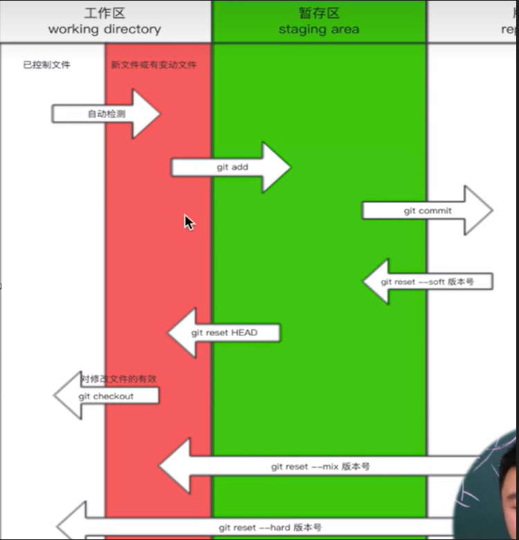

<!-- @import "[TOC]" {cmd="toc" depthFrom=1 depthTo=6 orderedList=false} -->

<!-- code_chunk_output -->

- [使用 Git 进行版本控制的基础要点：](#使用-git-进行版本控制的基础要点)
    - [个人信息的配置：](#个人信息的配置)
- [Git 的三个区域：](#git-的三个区域)
- [git的相关配置](#git的相关配置)
    - [Git 配置文件位置](#git-配置文件位置)
    - [SSH 免密登录](#ssh-免密登录)
    - [Git 忽略文件](#git-忽略文件)
    - [任务管理](#任务管理)
- [git的分支操作](#git的分支操作)
    - [1. 分支介绍](#1-分支介绍)
    - [2. 常用分支操作命令](#2-常用分支操作命令)
    - [3. 工作流程示例](#3-工作流程示例)
- [命令](#命令)
    - [1. 回滚到之前的版本](#1-回滚到之前的版本)
    - [2. 查看版本历史](#2-查看版本历史)
    - [3. 恢复回滚操作](#3-恢复回滚操作)
    - [4. 重置文件状态](#4-重置文件状态)
    - [5. 将文件从暂存区返回工作区](#5-将文件从暂存区返回工作区)
    - [6. 从版本库变回到之前的版本（保留暂存状态）](#6-从版本库变回到之前的版本保留暂存状态)
- [git推送远程仓库方法](#git推送远程仓库方法)
    - [1. 打标签](#1-打标签)
    - [2. 创建新分支](#2-创建新分支)
    - [3. 远程仓库相关操作](#3-远程仓库相关操作)
    - [4. 克隆仓库和切换分支](#4-克隆仓库和切换分支)
    - [5. 推送和拉取分支](#5-推送和拉取分支)
- [合并分支，解决冲突](#合并分支解决冲突)
    - [1. `rebase` 命令](#1-rebase-命令)
    - [2. 合并多余的分支](#2-合并多余的分支)
    - [3. 解决冲突](#3-解决冲突)

<!-- /code_chunk_output -->


## 使用 Git 进行版本控制的基础要点：

1. `git init`: 这个命令用于在当前目录下初始化一个新的 Git 仓库，使 Git 开始跟踪和管理该目录中的文件。

2. `git status`: 使用此命令可以查看当前工作目录下文件的状态。通常，红色表示新增文件或者修改了的文件，绿色表示已经被 Git 管理起来了。

3. `git add`: 这个命令用于将文件从工作区添加到暂存区，即将要提交的文件的更改放入缓存区。

   - `git add .`: 这是一个快捷方式，将当前目录下的所有文件和文件夹中的更改都添加到暂存区。

4. `git commit -m '描述信息'`: 通过此命令可以创建一个新的版本（提交）。你需要提供一个描述信息，以解释这个版本的更改内容。提交后，更改会被永久记录在版本库中。
- `git commit -m "Commit at $(date +'%Y-%m-%d %H:%M:%S')"`将描述信息改为当前的时间。

5. `git log`: 这个命令用于显示 Git 仓库中的版本历史，包括每个版本的提交信息、作者、日期等。

#### 个人信息的配置：

- `git config --global user.email "you@example.com"`: 这个命令用于配置全局 Git 用户的电子邮件地址，这是在提交版本时标识作者的一部分。

- `git config --global user.name "Your Name"`: 这个命令用于配置全局 Git 用户的姓名，也是在提交版本时标识作者的一部分。



## Git 的三个区域：

1. 工作区（Working Directory）：这是你正在工作的目录，包含项目的实际文件。

2. 暂存区（Staging Area）：也被称为索引（Index），是一个缓存区域，用于存储即将提交的更改。通过 `git add` 命令将工作区的更改添加到暂存区。

3. 版本库（Repository）：也被称为 Git 仓库，它包含了项目的完整历史记录，包括所有提交的版本。通过 `git commit` 命令将暂存区的更改保存为一个新的版本。

这些是 Git 的核心概念，它们使你能够跟踪和管理项目的版本历史，以及在多人协作中有效地合并和管理代码更改。

## git的相关配置

你提供的内容总结了Git配置文件的位置，SSH免密登录配置，Git忽略文件，以及一些与任务管理相关的概念。下面我将对这些内容进行进一步整理：

#### Git 配置文件位置

1. **本地项目配置文件**：`.git/config`，这个配置文件只对当前项目生效，你可以使用 `git config --local ...` 命令来配置。

2. **全局配置文件**：`~/.gitconfig`，这是全局的配置文件，适用于你系统上的所有Git项目，你可以使用 `git config --global ...` 命令来配置。

3. **系统配置文件**：`/etc/.gitconfig`，这是系统级别的配置文件，需要root权限来编辑，影响系统上的所有用户和项目，使用 `git config --system ...` 来配置。

#### SSH 免密登录

1. 生成SSH密钥对：使用 `ssh-keygen -t rsa` 命令生成一对SSH公钥和私钥，默认放在 `~/.ssh` 目录中。

2. 将SSH公钥内容添加到GitHub或其他Git托管服务的账户设置中，以便进行免密登录。

3. 在Git本地项目中配置使用SSH地址：使用 `git remote add origin 地址` 命令，来添加远程仓库的SSH地址。

4. 使用免密登录推送代码：之后，你可以使用 `git push origin 分支` 等命令，无需再输入密码即可推送代码。

#### Git 忽略文件

Git 忽略文件可以通过一个名为`.gitignore`的文件来配置。在这个文件中，你可以列出不希望Git管理的文件、文件夹或通配符。例如，你可以使用以下方式来配置：

```
# 忽略所有以 .log 结尾的文件
*.log

# 忽略一个文件夹及其内容
my-folder/

# 排除一个特定文件或文件夹，不被忽略
!important-file.txt
```

#### 任务管理

Git项目管理中常用的一些概念包括：

- **Issues**：用于提出问题、Bug报告或功能请求，可以分配给特定的团队成员，并可以为其添加标签、里程碑等信息。

- **Wiki**：项目相关信息的文档和知识库，可以用于记录项目的文档、指南、常见问题等。

这些功能可以帮助团队更好地管理项目，跟踪问题和任务，以及共享相关信息和文档。

## git的分支操作

#### 1. 分支介绍

在Git中，分支是版本控制的一个重要概念，它允许开发者创建独立的代码分支，以便并行开发不同的功能或修复不同的问题。主要分支通常是`master`（或`main`）分支，它代表了项目的稳定状态，而其他分支则用于开发新功能、修复bug等任务。

#### 2. 常用分支操作命令

- `git branch`：查看当前所有分支以及当前所处的分支。
- `git branch 分支名`：创建一个新分支，例如：`git branch feature-branch`。
- `git branch -d 分支名`：删除一个分支，使用 `-d` 标志，例如：`git branch -d feature-branch`。注意，删除分支时需要确保分支的工作已经合并到其他分支或不再需要。
- `git checkout 分支名`：切换到指定的分支，例如：`git checkout feature-branch`。
- `git merge 分支名`：合并指定分支的更改到当前分支。首先，切换到目标分支，然后运行合并命令，例如：`git merge feature-branch`。合并时可能会发生冲突，需要手动解决。

#### 3. 工作流程示例

在实际开发中，常见的工作流程包括：

- **主分支（例如 `master` 或 `main`）**：代表了项目的稳定版本，一般只包含已经发布的代码。

- **开发分支（例如 `dev` 或 `develop`）**：用于日常开发工作，新功能的开发和bug修复通常在这个分支上进行。

- **特性分支**：为了开发新功能或修复一个特定的问题，创建临时分支，例如 `feature-branch` 或 `bugfix-branch`。在这些分支上进行开发，开发完毕后合并回开发分支。

- **合并流程**：开发完毕后，通过切换到开发分支（如 `dev`），运行 `git merge` 命令将特性分支的更改合并到开发分支中。如果有冲突，需要解决冲突后再次提交。

这个工作流程允许团队成员独立开发不同的功能，最终将它们整合到主分支中，保持项目的稳定性。

Git的分支机制为团队协作和版本控制提供了强大的支持，使开发变得更加灵活和可管理。

## 命令

#### 1. 回滚到之前的版本

- `git reset --hard 版本号`：使用该命令可以将工作区、暂存区和版本库都回滚到指定版本，版本号通常可以通过 `git log` 查看。

#### 2. 查看版本历史

- `git log`：查看版本历史，可以获取版本号和提交信息，以便确定要回滚到的特定版本。

#### 3. 恢复回滚操作

- `git reflog`：查看引用日志，用于查看所有的分支操作历史，包括回滚操作。

- `git reset --hard 版本号`：根据引用日志中的记录，可以重新恢复回滚操作。

#### 4. 重置文件状态

- `git checkout -- 文件名`：用于重置工作区中修改的文件，使其回到已有版本的状态。这个命令可以撤销对单个文件的修改。

#### 5. 将文件从暂存区返回工作区

- `git reset HEAD 文件名`：将指定文件从暂存区（索引）返回到工作区，这意味着你可以重新编辑文件并重新提交它。

#### 6. 从版本库变回到之前的版本（保留暂存状态）

- `git reset --soft 版本号`：将版本库回滚到指定版本，但保留工作区和暂存区的状态。这允许你重新提交之前的更改。

需要注意的是，使用这些命令时要谨慎，特别是 `git reset --hard`，因为它会彻底丢弃工作区和暂存区的更改。确保在操作之前备份重要的更改或提交，以避免数据丢失。

## git推送远程仓库方法

你提供的内容总结了一些常见的Git命令和操作，下面我将整理和补充一下：

#### 1. 打标签

- `git tag -a v1 -m '描述信息'`：为当前版本打一个带有描述信息的标签。
- `git push origin --tags`：将标签推送到远程仓库（例如GitHub）。

#### 2. 创建新分支

- `git checkout -b 分支名`：从当前分支上创建一个新分支并切换到该分支。

#### 3. 远程仓库相关操作

- `git remote add origin git@github.com:4xx2/demo.git`：为远程仓库地址起一个别名，通常习惯使用`origin`作为远程仓库的别名。
- `git branch -M 新分支`：将分支重命名。
- `git push -u origin main`：将本地的`main`分支推送到远程仓库的`main`分支，并建立关联。

#### 4. 克隆仓库和切换分支

- `git clone 链接`：克隆远程仓库到本地，通常会自动创建一个名为`origin`的远程仓库别名。
- 默认情况下，`git clone` 只会拉取远程仓库的 `master`（或 `main`）分支，但实际上你本地会有所有分支的镜像，只是没有在本地显示。
- `git checkout 分支`：切换到指定分支，例如：`git checkout dev`。

#### 5. 推送和拉取分支

- `git push origin 分支`：将本地的分支推送到远程仓库的相应分支，例如：`git push origin dev`。
- `git pull origin dev`：拉取远程分支的最新更改，等价于先运行 `git fetch origin dev` 拉取远程分支到本地，然后运行 `git merge origin/dev` 合并远程分支到工作区。

## 合并分支，解决冲突

#### 1. `rebase` 命令

`git rebase` 是一个用于整理提交历史的强大工具，它可以将一个分支的更改移动到另一个分支上，并保持提交记录的简洁。

- `git rebase 分支`：将当前分支上的更改以线性方式添加到目标分支上。这将使目标分支的历史更加整洁，但可能会产生冲突需要解决。

- `git rebase -i 版本号`：通过交互式 rebase 可以将多个提交记录合并为一个，以便整理提交历史。你可以在交互式编辑器中选择要保留或合并的提交记录，并编辑提交信息。
- `git rebase -i HEAD~3`	#当前版本和之前总计 3个版本合并成一个版本
				#版本前加s，表示将当前版本合并到上一个版本
				#编写描述信息
- 注意：合并记录时，不要合并已经上传到github的版本。

#### 2. 合并多余的分支

如果你有一个分支，想将其合并到主分支，可以使用以下步骤：

1. 使用 `git log --graph` 或 `git log --graph --pretty=format:"%h %s"` 查看提交历史以确保分支关系。
    `git log --graph	#以图形方式显示log记录`;
    `git log --graph --pretty=format:"%h %s"	#格式化显示log记录`

2. 切换到要合并的分支，例如 `dev` 分支。

3. 运行 `git rebase master`，这将把 `master` 分支上的更改以线性方式添加到当前分支上。

4. 切换回 `master` 分支，运行 `git merge dev` 来合并 `dev` 分支的更改到 `master` 分支。

这样，你就将 `dev` 分支的更改整合到了 `master` 分支，保持了提交历史的线性性。

#### 3. 解决冲突

在进行`rebase`或合并操作时，可能会发生冲突。Git冲突解决是在多个开发者同时修改同一个Git仓库中的同一文件或同一行代码时发生的情况。当Git无法自动合并这些修改时，就会产生冲突，需要手动解决。

以上是关于`rebase`、合并分支和解决冲突的基本操作，它们有助于管理提交历史和协作开发。确保在操作之前理解这些命令的工作原理，以免不小心丢失数据或引入问题。


