原文：[从零搭建个人博客](https://zhuanlan.zhihu.com/p/102592286)
# Github账号注册
# Git安装
# 绑定Github
**SSH**是"Secure Shell"的缩写，它是一种用于安全远程访问计算机系统的网络协议和工具。SSH的主要目的是通过加密和身份验证机制来保护网络通信的安全性，以防止未经授权的访问和数据泄漏。

在使用Git上传文件到GitHub或其他远程代码仓库时，你需要在本地计算机上配置SSH密钥以便进行安全的身份验证。这是为了确保只有授权的用户能够上传文件到你的GitHub仓库，同时也确保了通信的加密和安全性。

口令登录和公钥登录是两种不同的SSH身份验证方法：

1. 口令登录：口令登录是指使用用户名和密码进行SSH登录。你会被要求在每次连接远程主机时输入你的用户名和密码。

2. 公钥登录：公钥登录是一种更加方便的方式，它使用了非对称加密技术。在这种方法下，你会生成一对密钥，包括一个私钥和一个公钥。私钥储存在你的本地计算机上，而公钥储存在远程主机上。当你尝试连接远程主机时，你的本地SSH客户端会使用私钥进行身份验证，而远程主机会验证你的公钥。如果匹配成功，你就会被允许登录。

对于GitHub，推荐使用公钥登录。这意味着你需要生成SSH密钥对，将公钥添加到你的GitHub帐户中，并在本地Git配置中指定私钥文件的路径。这样，每次与GitHub通信时，Git会使用你的私钥进行身份验证，而不需要输入密码。这提供了便利性。

**非对称加密**是一种密码学技术，与对称加密相对。在非对称加密中，存在一对密钥，一个是公钥（public key），另一个是私钥（private key）。这两个密钥是相关联的，但不同的是，公钥可以公开分享，而私钥必须保持秘密。

简单讲，非对称加密的工作方式如下：

1. 加密：当一个用户想要将一条信息发送给另一个用户时，他们会使用接收方的公钥来加密消息。这意味着只有拥有相应私钥的接收方才能解密消息。

2. 解密：接收方使用其私钥来解密收到的加密消息。由于私钥是保密的，只有接收方能够成功解密消息。

非对称加密的主要优势在于它提供了安全的密钥交换机制，不需要事先共享密钥。这意味着即使在不安全的通信渠道上，发送方可以使用接收方的公钥进行加密，只有接收方才能使用其私钥解密消息。这样的加密方式在安全通信、数字签名、身份验证等领域广泛应用。

> 非对称加密的两种应用：
> 1. 安全通信：A发消息给B，A的消息经过B公钥的加密后发出去，加密信息只有通过B的私钥才能解密，B可以用自己独有的私钥解密。
> 2. 数字签名：A使用私钥对数据进行签名，发给B，B通过A的公钥可以确定是否是A。与SSh连接远程主机的过程类似。

#### 绑定步骤
1. 输入 ssh 命令，查看本机是否安装 SSH：
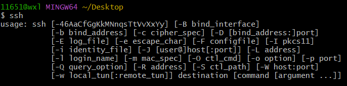
2. 生成公钥私钥：
输入 ssh-keygen -t rsa 命令（注意空格），表示我们指定 RSA 算法生成密钥，然后敲四次回车键，之后就就会生成两个文件，分别为秘钥 id_rsa 和公钥 id_rsa.pub. （注意：git中的复制粘贴不是 Ctrl+C 和 Ctrl+V，而是 Ctrl+insert 和 Shift+insert.）文件的位置在 Git Bash 上面都有显示，默认生成在以下目录：
Linux 系统：~/.ssh
Mac 系统：~/.ssh
Windows 10 ：C:/Users/ASUS/.ssh
3. 把公钥 id_rsa.pub 的内容添加到 GitHub
可以通过目录找到 id_rsa.pub 文件的位置，用记事本打开文件复制。如果你实在找不到文件也没有关系，按照以下步骤直接在 Git Bash 上打开就行：
```bash
$ cd ~/.ssh 
$ ls
$ cat id_rsa.pub
```
接下来进入我们的 GitHub 主页，先点击右上角，再点击 settings
先点击 SSH and GPG keys，再点击 New SSH key.
将复制的公钥 id_rsa.pub 的内容粘贴到 key 内，再点击 Add SSH key
验证是否成功，我们可以通过在 Git Bash 中输入 ssh -T git@github.com 进行检验：
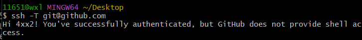
设置Git的用户信息，包括用户名和邮箱地址，以便Git能够识别你的身份。你可以运行以下命令来设置全局的Git用户信息：
```bash
git config --global user.email "you@example.com"
git config --global user.name "Your Name"
```
> 需要使用 git push 上传一次；绑定仓库；不然后续出错

# 购买域名
万网购买域名
[万网-阿里云](https://wanwang.aliyun.com/)
注册一个账号、搜索合适的域名、未注册的域名点击加入清单，按步骤操作，购买即可，需要实名认证，上传身份证。等待审核完成....
# 安装node.js和Hexo
**Node.js**（通常简称为 Node）是一个基于 Chrome V8 JavaScript 引擎构建的开源服务器端运行环境。Node.js 允许开发者使用 JavaScript 编写服务器端应用程序，这是与传统的浏览器端 JavaScript 不同的地方。
**Hexo**是一个基于Node.js的静态博客生成器。它允许用户使用Markdown或其他标记语言来编写文章，并将这些文章转换成静态网页，可以轻松地部署到不同的托管平台上，如GitHub Pages或自己的服务器。Hexo具有高度可定制性，用户可以选择不同的主题和插件来扩展其功能，以创建符合自己需求的博客网站。这个工具通常被用来创建个人博客、技术博客或文档网站等静态网站。
### Node.js
安装网站：[node.js](https://blog.csdn.net/antma/article/details/86104068)
注意在建立两个文件夹node_global与node_caceh时，需要右键设置“属性”,将用户具有完全属性的权限，否则在npm install webpack时会报错。后续npm操作时也会报错。
### Hexo
[知乎网站安装Hexo](https://zhuanlan.zhihu.com/p/105715224)
Github上新建一个仓库，命名为“用户名.github.io”
D盘建立一个文件夹 Blog，点开 Blog 文件夹，鼠标右键打开 Git Bush Here，输入npm命令安装Hexo：
```bash
npm install -g hexo-cli
```
如果报错，可能是没有修改权限。

安装完成后，输入 hexo init 命令初始化博客：
> 如果出现hexo command not found要配置环境变量，在path中加入：D:\program\Nodejs\node_global\node_modules\hexo-cli\bin

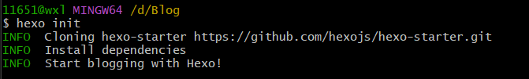

然后输入 hexo g 静态部署：
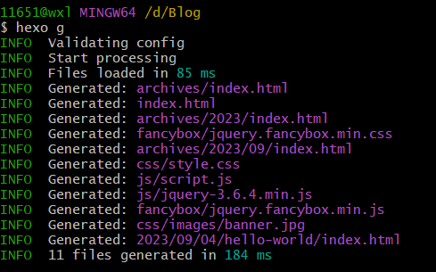

这时网页已经部署完成，输入 hexo s 命令可以查看：
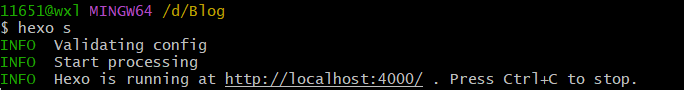

浏览器输入 http://localhost:4000/ 就可以打开新部署的网页：

现在回到我们的 Blog 文件夹，用笔记本打开 _config.yml 文件，并在末尾加入以下内容：
deploy:
  type: git
  repository: https://github.com/4xx2/4xx2.github.io.git  #你的仓库地址
  branch: main

然后回到 Blog 文件夹中，打开 Git Bash，安装Git部署插件，输入命令：
```bash
npm install hexo-deployer-git --save
```
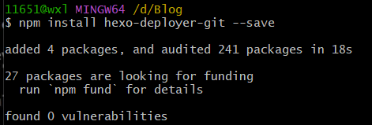

然后分别输入以下三条命令：
```bash
hexo clean   #清除缓存文件 db.json 和已生成的静态文件 public
hexo g       #生成网站静态文件到默认设置的 public 文件夹(hexo generate 的缩写)
hexo d       #自动生成网站静态文件，并部署到设定的仓库(hexo deploy 的缩写)
```
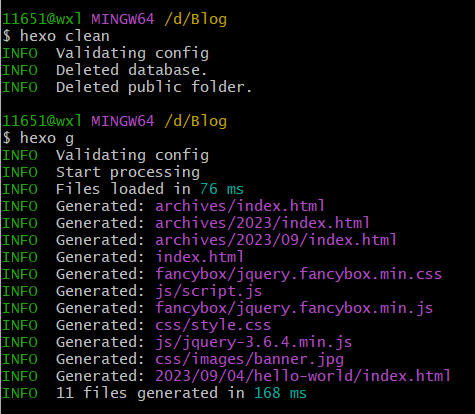
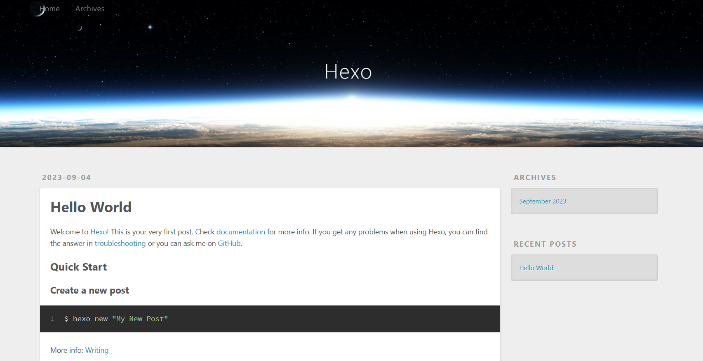

# 解析域名
第一步：登陆域名网站[万网-阿里云](https://wanwang.aliyun.com/)，已购买的域名后点击解析添加如下的解析记录：
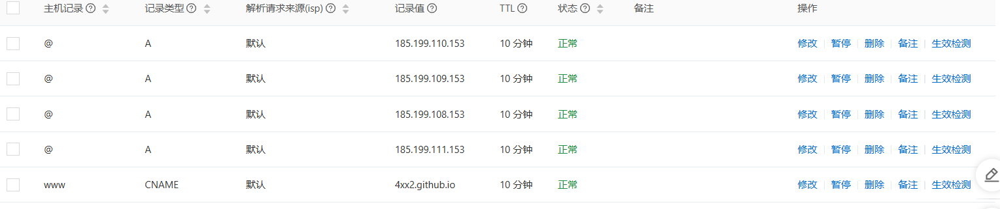

第二步：打开 Blog 文件夹里的 source 文件夹，添加CNAME文件，可以先创建一个CNAME.txt文件，打开后写上你的域名，不要加www否则每次访问都必须加www，但如果不带有www，以后访问的时候带不带www都可以访问，保存后记得要重命名，将.txt删除，如下图：
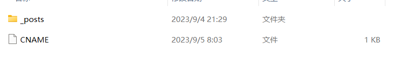
第三步回到 Blog 文件夹，右键打开 Git Bash，依次输入下面三条命令：
```bash
hexo clean
hexo g
hexo d
```
打开GitHub，看看CNAME文件是否已经在你的项目中，点击 settings ：
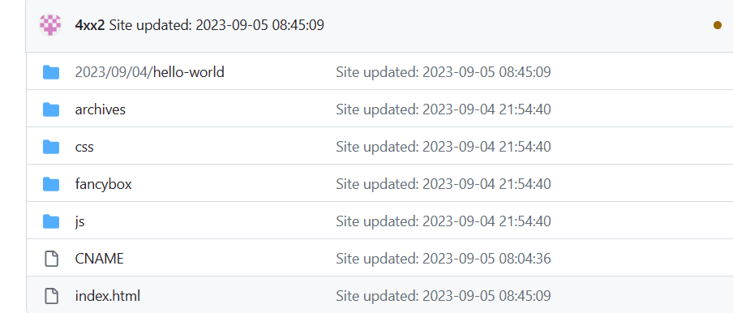
查看你的网址是否已保存：
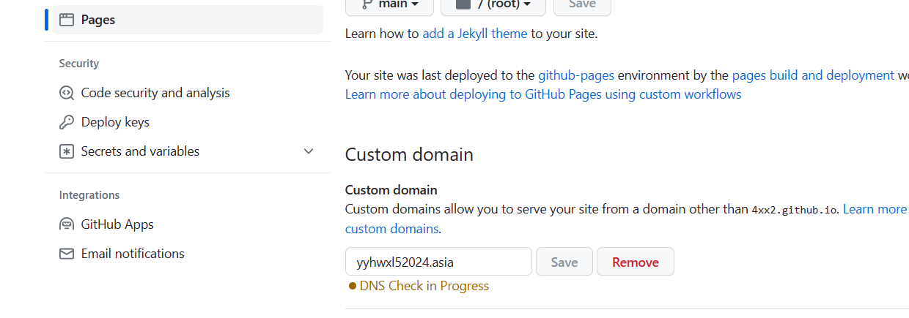

# 设置next主题
更换主题
当前用得最多的是next主题，那为什么用得多呢？当然是符合大多数人的审美。我使用的是next(v7.7.1)，下载地址：[github-next](https://github.com/theme-next/hexo-theme-next)

打开博客根目录Blog文件夹，右键Git Bash，输入如下代码将next主题下载到目录Blog/themes：

```bash
git clone https://github.com/theme-next/hexo-theme-next themes/next
```

#### 下载过程中提示错误的解决办法
1-**可能的原因**
第一，因为git在拉取或者提交项目时，中间会有git的http和https代理，但是我们本地环境本身就有SSL协议了，所以取消git的https代理即可，不行再取消http的代理。
第二，原因还有一个，当前代理网速过慢，所以偶尔会成功，偶尔失败。

> **SSL**（Secure Sockets Layer）是一种安全协议，用于在计算机网络上加密通信。它的主要目的是保护数据在客户端和服务器之间的传输过程中的机密性和完整性，以防止数据被未经授权的第三方恶意截取或篡改。
大多数现代计算机和应用程序都默认启用了SSL/TLS支持
> **代理服务器**（Proxy Server）是一种位于计算机网络中的中间服务器，它充当客户端和目标服务器之间的中介，用于处理客户端请求并将请求转发到目标服务器，然后将目标服务器的响应返回给客户端。

2-**解决方案**
第一，取消git本身的https代理，使用自己本机的代理，如果没有的话，其实默认还是用git的
```bash
//取消http代理
git config --global --unset http.proxy
//取消https代理 
git config --global --unset https.proxy
```
第二，科学上网（vpn），这样就能提高服务器连接速度，能从根本解决 time out 443问题
第三，检查和清除Git配置文件和环境变量中的代理设置。
步骤：
  **查看Git配置**：首先使用以下命令查看全局Git配置：
   ```
   git config --global -l
   ```
   如果配置中包含与HTTPS代理相关的内容，如 `https_proxy = ...`，则问题可能出在这里。

  **删除HTTPS代理配置**：如果在全局配置中存在与HTTPS代理相关的内容，例如 `https_proxy = ...`，则建议从 `~/.gitconfig` 文件中删除这些配置。
  **取消设置环境变量**：使用以下命令逐个取消设置环境变量中的HTTPS代理设置：
   ```
   env|grep -i proxy
   ```
   如果显示了相关设置，例如 `https_proxy = ...`，请取消设置这些变量。如果不再显示任何代理设置，那么问题可能已解决。

第四，手动配置Git的代理设置，以使用本地代理。
步骤：
**手动配置Git代理**：在启动Shadowsocks代理的前提下，可以手动配置Git的代理，使用以下命令分别设置HTTP和HTTPS代理：
   ```
   git config --global http.proxy http://127.0.0.1:1080
   git config --global https.proxy http://127.0.0.1:1080
   ```
   这将告诉Git使用本地的Shadowsocks代理。
**取消代理设置**：如果不再需要代理，可以使用以下命令取消Git的代理设置：
   ```
   git config --global --unset http.proxy
   git config --global --unset https.proxy
   ```

打开根目录下的_config.yml(称为站点配置文件)，修改主题（注意冒号后都要有空格）：
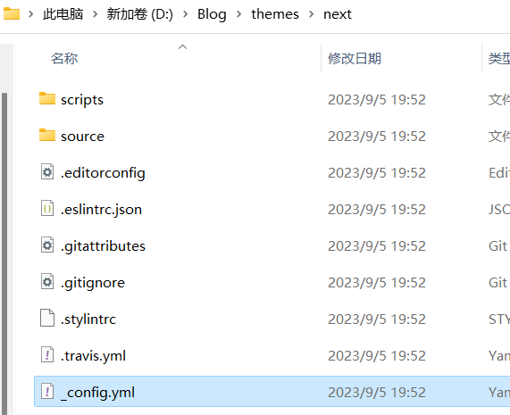
> 主题语言主要是看你的themes/next/language中的简体中文是 zh-CN 还是 zh-Hans;
```
# Site
title: 枫叶苑  #标题
subtitle: ''
description: 选择有时候比努力更重要     #简介或者格言
keywords:
author: 枫叶     #作者
language: zh-CN     #主题语言
timezone: Asia/Shanghai    #中国的时区

# Extensions
## Plugins: https://hexo.io/plugins/
## Themes: https://hexo.io/themes/
theme: next   #主题改为next
```
打开目录Blog/themes/next/下的_config.yml（称为主题配置文件），只要将你选的主题前的#删除就行了：
> next主题有四种，如下图依次为Muse、Mist、Pisces、Gemini
```
# Schemes
#scheme: Muse
#scheme: Mist
#scheme: Pisces
scheme: Gemini    #这是我选的主题
```

回到根目录打开Git Bash，输入如下三条命令：

hexo clean
hexo g
hexo d
完成后打开你的博客：
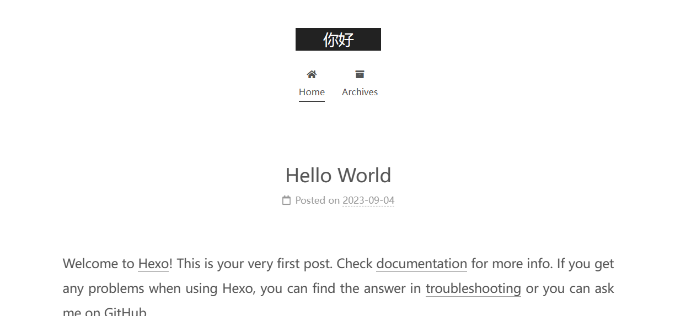

> 可以用 hexo s 命令查看网页部署
> `hexo s` 是 Hexo 静态网站生成器中的一个命令，用于启动本地服务器以预览和测试你的博客或网站。具体来说，它有以下含义：
> - `hexo`：这是 Hexo 命令行工具的名称，你使用它来执行各种 Hexo 相关操作。
> - `s`：这是 `server` 命令的简写，用于启动本地服务器。
> 当你运行 `hexo s` 命令时，Hexo 会启动一个本地服务器，并将你的博客或网站在本地主机上的指定端口上提供。你可以通过访问 `http://localhost:4000`（默认情况下，端口为4000）在浏览器中预览你的博客或网站。

#### 默认端口无法打开网站怎么办
**问题描述**：
服务器上成功安装了 Hexo，并成功运行了 `hexo g` 和 `hexo server` 命令。
运行 `hexo server` 后，控制台显示 Hexo 正在运行在 `http://localhost:4000/`。
但是，当你尝试通过服务器的公网IP地址（假设为 xxx.xxx.xxx.xxx）访问 `http://xxx.xxx.xxx.xxx:4000/` 时，无法正常访问页面。

**可能原因和解决方法**：
1. 服务器的4000端口被占用：你可以使用 `lsof -i:4000` 命令来查看端口是否被占用。*window系统可以使用`netstat -ano | findstr :4000`查看端口是否占用。*

2. 如果需要更改端口，可以使用 `hexo s -p xxxx` 命令指定一个不被占用的端口，然后确保该端口被正确开放。xxxx为新的端口号。

# 主题优化
参考：[知乎](https://zhuanlan.zhihu.com/p/106060640)
1. 设置菜单
打开主题配置文件即themes/next下的_config.yml，查找menu，将前面的#删除就行了：
```yaml
menu:
  home: / || home                      #首页
  archives: /archives/ || archive      #归档
  categories: /categories/ || th       #分类
  tags: /tags/ || tags                 #标签
  about: /about/ || user               #关于
  resources: /resources/ || download   #资源
  #schedule: /schedule/ || calendar    #日历
  #sitemap: /sitemap.xml || sitemap    #站点地图，供搜索引擎爬取
  #commonweal: /404/ || heartbeat      #腾讯公益404
```
“||”前面的是目标链接，后面的是图标名称，next使用的图标全是图标库 - Font Awesome 中文网这一网站的，有想用的图标直接在fontawesome上面找图标的名称就行。resources是“我”自己添加的。

新添加的菜单需要翻译对应的中文，打开theme/next/languages/zh-CN.yml，在menu下设置：
```yaml
menu:
  home: 首页
  archives: 归档
  categories: 分类
  tags: 标签
  about: 关于
  resources: 资源
  search: 搜索
```

# 迁移到另一台电脑

将本地的hexo文件内容推送到github上的hexo分支，然后再新电脑下载这些文件并操作即可：
  上传hexo文件不需要全部上传，只需要上传部分，另外一部分忽略，可以新建一个.gitignore文件，存放需要忽略的文件内容：
```bash
touch .gitignore  # 新建文件
```
将.gitignore打开并输入需要忽略的文件：
``.DS_Store
Thumbs.db
db.json
*.log
node_modules/
public/
.deploy*/
_multiconfig.yml``
上传hexo文件到github：
```bash
git init  //初始化本地仓库
git add -A  // 添加本地文件
git commit -m "源文件hexo"
git branch -m master hexo   // 将当前分支改名为hexo
git remote add origin git地址  // 将远程仓库地址改为origin
git push origin hexo
```

新电脑上下载node.js和hexo，不要用`hexo init`初始化，而是从github下载hexo分支：
```bash
git clone -b hexo git地址 .  // 最后加一个“.”，表示直接下载到当前文件夹内
```
下载成功后运行`npm install`即可成功。

