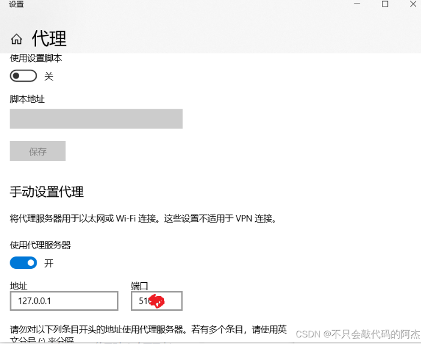

报错信息："fatal unable to access 'httpsgithub.comxxxxxxxxxxx.git' Recv failure Connection was reset" 表明无法访问指定的 Git 仓库，连接被重设。

解决此问题有两种方法：

**解决方法一：删除代理**

如果你没有明确配置代理，但仍然遇到此问题，可以通过以下步骤删除可能存在的全局 Git 代理配置：

1. 首先查看全局 Git 配置，以确认是否存在代理配置：

```bash
git config --global -l
```

2. 如果发现有代理配置，可以使用以下命令删除 HTTP 和 HTTPS 代理配置：

```bash
git config --global --unset http.proxy
git config --global --unset https.proxy
```

**解决方法二：手动配置代理**

如果你开启了网络代理，导致连接问题，可以手动配置 Git 代理：

1. 首先查看全局 Git 配置：

```bash
git config --global -l
```

1. 找到你的代理服务器的信息，特别是端口号。

2. 使用以下命令配置 Git 代理，将 "xxx" 替换为你的代理服务器的 IP 地址和端口号：

```bash
git config --global http.proxy http://127.0.0.1:xxx
```

一般情况下，如果你没有明确配置代理，不需要手动设置代理即可访问 GitHub 等外部 Git 仓库。但如果你的网络环境需要代理，确保正确配置本机的代理信息。在电脑搜索栏搜索“代理服务器设置”，在其中正确配置：




