[B站-计算机速成](https://www.bilibili.com/video/BV1EW411u7th/?vd_source=df35f9f0eb3432ee06a5f67e4c43f835)
笔记
## 计算机早期历史时间线：

公元前2500年：
- 算盘出现，是一种十进制计算工具，类似于一个计数器。

公元前2500年 - 公元1500年：
- 出现依靠机械运动的计算设备，如星盘和计算尺。

公元1613年：
- 出现"computer"的概念，当时指的是专门从事计算工作的职业。

1694年：
- 步进计算器问世，是世界上第一台能够自动完成加法、减法、乘法和除法运算的计算器。

1694年 - 1900年：
- 计算表兴起，类似于字典，可用于查找各种复杂的计算值。

1823年：
- 出现差分机的设想，这种设备可以进行函数计算，但最终计划失败。
- 旨在自动执行多项式计算。差分机使用了齿轮和杠杆系统，可以进行基本的数学运算，如加法和减法。这个设备的设计概念为后来的计算机奠定了基础。

19世纪中期：
- 分析机的设想出现，人们设想存在一种通用计算机，可以计算一切。
- 分析机使用穿孔卡片来编程和输入数据，这一思想在后来的计算机中得到了延续。

1890年：
- 打孔卡片制表机问世，其原理是在纸卡上打孔，孔穿过针，针泡入汞，从而完成电路连接，齿轮使计数器增加1。
- 赫尔曼·何乐礼发明了一种打孔卡片制表机，用于处理和分析大量数据，特别是在人口普查等大规模统计工作中。这些机器使用打孔卡片作为数据输入，通过读取卡片上的孔来执行各种计算任务。何乐礼的发明最终导致了计算机技术的商业化应用，创立了IBM公司。

这些里程碑事件标志着计算机技术的演进，从最早的计数工具到通用计算机的概念的逐渐发展，为现代计算机的诞生奠定了基础。

## 电子计算机发展史

电子计算机的发展历程：

**电子计算机元器件的演进：**
   - 从早期的**继电器**，到后来的**真空管**，再到更可靠的**晶体管**，电子计算机的元器件逐步演进，为计算性能的提升和计算机的可靠性奠定了基础。

**计算机的出现背景：**
   - 20世纪，人口急剧增加，科学和工程领域迅速发展，航天计划等项目加速进行，导致数据复杂度激增和计算需求急剧上升，促使了对自动化和高速计算的紧迫需求。

**电子计算机的发展历程：**
   - 从1940年代初期的继电器计算机和早期的真空管计算机，如哈佛马克1和巨人1号，到ENIAC成为第一台通用计算机的代表，再到晶体管的问世，电子计算机的发展经历了重要阶段。最终，晶体管技术的引入标志着电子计算机元器件的现代化，为计算机技术的商业化应用铺平了道路。

继电器、真空管和晶体管都是电子元件，用于控制电流的流动和电信号的处理。下面是它们的工作原理的简单通俗解释：

1. **继电器：**
   - 继电器就像一个电磁开关。当电流通过继电器的线圈时，线圈中产生一个电磁场，这会吸引一个可移动的金属片（触点）。当金属片被吸引时，触点闭合，允许电流通过继电器的主电路。
   - 这就好像你按下开关来控制灯的亮灭一样。继电器的工作原理类似，只不过是使用电磁力来打开或关闭电路。

2. **真空管：**
   - 真空管是一个真空密封的玻璃管内有电极的设备。在管内抽取空气，创建真空后，电子从一个电极（阴极）发射出来，经过真空中的空间，然后被另一个电极（阳极）吸引，从而形成电流。
   - 真空管的工作原理类似于电子的"阀门"，可以控制电子流的开启和关闭，因此它可以用来放大信号或执行开关操作。
   - 二极管就像一个电子流的"阀门"，只允许电流在一个方向上流动，通常被称为正向导通。
   - 三极管是一种更复杂的半导体器件，通常有三个电极：发射极、基极和集电极。

3. **晶体管：**
   - 晶体管是一个半导体元件，通常是硅或其他材料制成。它有三个电极：发射极、基极和集电极。晶体管的行为受到基极电流的控制。
   - 当在基极加电流时，它控制了发射极和集电极之间的电流流动。这种控制是通过**半导体**中的电子和空穴的运动来实现的，从而调节了整个晶体管的电流。
   - 晶体管的工作原理类似于一个电流控制的"开关"，通过控制输入信号电流来调整输出信号电流，使其可以用来放大信号、执行逻辑操作和存储信息。

总的来说，继电器通过电磁吸引控制电路的开关，真空管利用电子在真空中的流动，而晶体管通过半导体材料中的电子流动和控制来实现电流的调节。这些元件在电子设备中扮演着不同但关键的角色。

## 布尔逻辑和逻辑门

key：布尔代数

以下是关于布尔逻辑、逻辑门和二进制在计算机中的应用的整理：

**1. 为什么计算机使用二进制：**
- 计算机的元器件，如晶体管，只有两种状态：通电（1）和断电（0）。使用二进制可以直接映射到这两种状态，从而设计计算机。
- **布尔代数**是数学的一个分支，使用True（1）和False（0）进行逻辑运算，而不是使用实数，这与计算机中的数据表示方式相匹配。
- 计算的状态越多，信号混淆的可能性就越高，这会影响计算的准确性。使用二进制可以减少混淆。

**2. 布尔代数和逻辑门：**
- 布尔代数中只有两个变量：True（1）和False（0），没有常数。
- 布尔代数有三个基本操作：NOT、AND和OR，分别对应着逻辑门中的非门、与门和或门。
- 布尔代数中的这些操作允许进行逻辑运算，帮助计算机做出决策和执行各种任务。

**3. 逻辑门和晶体管的实现：**
- 逻辑门是逻辑运算的基本组成单元，可以由晶体管构建。晶体管充当开关，控制电流的流动。
- NOT门（非门）：将输入布尔值反转，使用半导体通电和不通电的方式实现，将输入的True变成False，反之亦然。

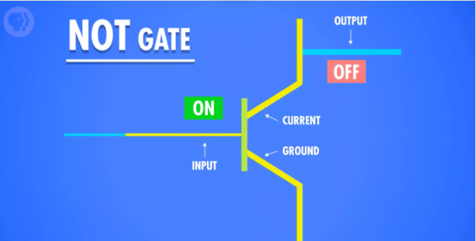

- AND门（与门）：仅当两个输入都为True时，输出为True，使用串联两个晶体管来实现。

- OR门（或门）：只要输入中至少有一个True，输出为True，使用并联两个晶体管来实现。

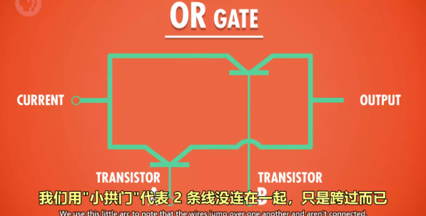

**4. 异或门（XOR门）：**
- XOR门（异或门）是一种特殊的逻辑门，其输出只在两个输入中仅有一个True时为True，其余情况输出为False。
- 异或门可以通过组合OR门、AND门和NOT门来构建，通过这些门的逻辑组合，实现了异或操作。

总的来说，布尔逻辑、逻辑门和二进制是计算机中基本的概念和工具，它们帮助计算机执行各种复杂的任务，从基本的逻辑运算到高级的数据处理和决策。逻辑门的构建基于晶体管等元器件的工作原理，通过它们的组合可以实现各种逻辑操作。

## 二进制

**1. 二进制原理和存储单位：**
- 二进制是计算机中的基本表示方式，只包含数字1和0，每位称为位（bit）。
- 1字节（byte）等于8位（8 bits），是计算机中的基本存储单元。
- 存储单位：
  - 1MB（兆字节）= 2^20 字节
  - 1GB（千兆字节）= 2^30 字节
  - 1TB（千兆兆字节）= 2^40 字节

**2. 十进制与二进制的区别和联系：**
- 十进制有10个数字（0-9），每向左进一位数字增加10倍。
- 二进制有2个数字（0-1），每向左进一位数字增加2倍。
- 联系：通过提取位数并分别计算，将十进制数转换为二进制数，反之亦然。

**3. 32位与64位计算机的区别：**
- 32位计算机的最大表示范围约为43亿左右，32位能表示的数字范围是0到2^32 - 1。
- 64位计算机的最大表示范围远远超过32位，能表示更大的数字范围，大约是9.2 x 10^18。

**4. 数字表示方法：**
- 整数：第1位表示正负，其余位存储实际数值（采用补码表示负数）。
- 浮点数：采用IEEE 754标准表示，分为符号位、指数位和有效位，用于存储小数。

**5. ASCII（美国信息交换标准代码）：**
- 用数字编号表示英文字母和符号，有128个不同的值。
- 7位二进制代码表示每个字符。

**6. Unicode：**
- 用于统一所有字符编码的标准，于1992年诞生。
- Unicode包含17个16位数字的组，可表示超过100万个字符，以满足各种语言的需求。

## 算术逻辑单元

ALU（算术逻辑单元）是计算机中的一个关键组件，它是计算机中的核心部分之一，负责执行数字和逻辑运算。ALU可以执行各种数学运算（如加法、减法、乘法、除法）以及逻辑运算（如AND、OR、NOT、XOR等），是计算机进行各种计算和决策的基本单元。

ALU通常包括两个主要部分：

1. **算术单元（Arithmetic Unit）：** 这部分负责执行数学运算，如加法和减法。它可以接收输入的数字数据，执行相应的数学运算，并产生输出结果。

2. **逻辑单元（Logic Unit）：** 这部分负责执行逻辑运算，如逻辑与（AND）、逻辑或（OR）、逻辑非（NOT）以及逻辑异或（XOR）。逻辑单元用于处理逻辑判断和条件运算。

在计算机体系结构中，ALU通常与寄存器文件（Register File）和控制单元（Control Unit）一起工作，以执行各种指令和操作。

算术逻辑单元（ALU）中的算术单元是计算机中的一个关键组成部分，负责执行各种数学运算，如加法、减法、乘法、除法等。以下是有关ALU中算术单元的详细笔记：

**算术单元的基本组成：**
1. **半加器（Half Adder）：**
   - 半加器是算术单元的基本构建块之一。
   - 它用于执行最低位的加法运算，即两个单独的二进制位相加。
   - 输入包括两个二进制位（A和B），输出包括两个部分：
     - 总和（Sum）：A和B的和。
     - 进位（Carry）：在相加时是否产生了进位（如果A和B都为1，则会产生进位）。

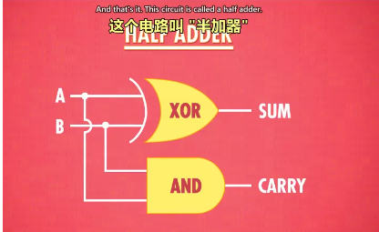

2. **全加器（Full Adder）：**
   - 全加器用于执行多位数的加法运算，处理了进位的情况。
   - 输入包括两个二进制位（A和B）以及一个来自上一位的进位信号（C_in）。
   - 输出包括两个部分：
     - 总和（Sum）：A、B和进位信号的总和。
     - 进位（Carry）：在相加时是否产生了进位（用于传递给下一位）。

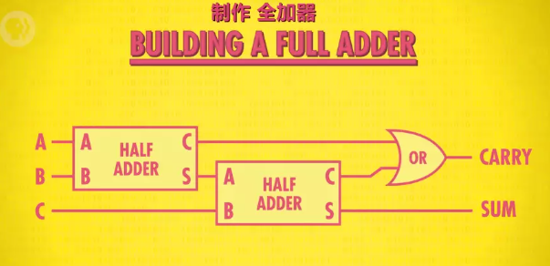

**8位数的加法：**
- 为了执行8位数的加法，可以通过连接1个半加器和7个全加器来实现。每个全加器的输入包括A、B和前一个全加器的进位信号，输出包括总和和进位信号。

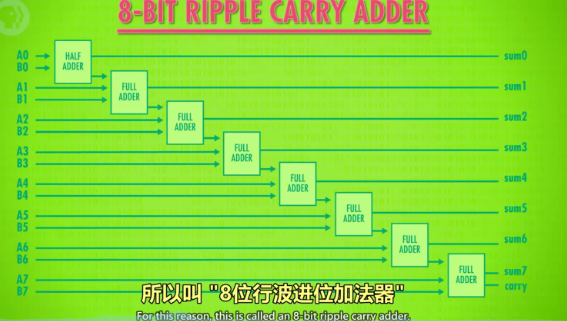

**超前进位加法器（Carry-Lookahead Adder）：**
- 现代计算机使用超前进位加法器来提高加法性能。
- 超前进位加法器可以预先计算出进位信号，从而加速加法运算，而不需要等待进位信号从低位传递到高位。

**其他支持的运算：**
- 算术单元不仅支持加法运算，还支持减法、乘法和除法等数学运算。
- 这些运算通常通过多次使用加法运算来实现，例如，乘法可以看作是多次执行加法，而减法可以通过加法和取反操作来实现。

**溢出概念：**
- 溢出是指在有限位数的表示范围内无法容纳结果的情况。
- 对于加法运算，如果最高位的进位为1，表示溢出，需要特殊处理。

ALU（算术逻辑单元）中的逻辑单元负责执行逻辑操作，如AND、OR、NOT等，以及进行简单的数值测试。以下是关于ALU中逻辑单元的笔记：

**1. 逻辑单元的基本功能：**
   - 逻辑单元执行各种逻辑运算，包括布尔代数运算和位级运算。
   - 它处理二进制数据，对输入数据进行逻辑操作，并生成相应的输出。

**2. 常见逻辑运算：**
   - **AND操作：** 逻辑AND操作将两个输入位相乘，只有当两个位都为1时，输出才为1，否则为0。
   - **OR操作：** 逻辑OR操作将两个输入位相加，只要有一个位为1，输出就为1，否则为0。
   - **NOT操作：** 逻辑NOT操作将输入位取反，即0变为1，1变为0。
   - **XOR操作：** 逻辑XOR（异或）操作将两个输入位进行异或运算，只有当两个位不相等时，输出才为1，否则为0。

**3. 逻辑单元的输出：**
   - 逻辑单元的输出通常是一个或多个位，表示运算的结果。
   - 这些输出位可以被传递到其他部件，如寄存器或存储单元，以供后续计算或操作使用。

ALU的抽象

作用： ALU的抽象使工程师不必考虑逻辑门层面的具体组成，从而简化了工作。
图示： ALU通常用一个大的“V”符号表示，包括输入A、输入B以及输出和标志输出（如溢出、零、负数标志）。
ALU是计算机中的关键部件，它的运算能力和灵活性对计算机的性能和功能起着至关重要的作用。理解ALU的工作原理对于计算机科学和工程领域的学生和专业人士都是非常重要的。

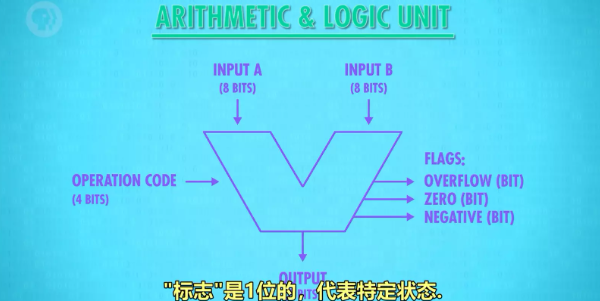

## 寄存器与内存

**锁存器（Latch）**：
   - 锁存器是一种电子电路元件，用于存储一个位（通常是0或1）。它通过逻辑门（通常是AND、OR、NOT门）的组合来实现。
   - 锁存器有两个主要状态，称为设置（set）和复位（reset）。当设置状态激活时，锁存器会保持高电平，当复位状态激活时，它会保持低电平。
   - 锁存器通常用于构建更复杂的数字电路，如寄存器和内存。

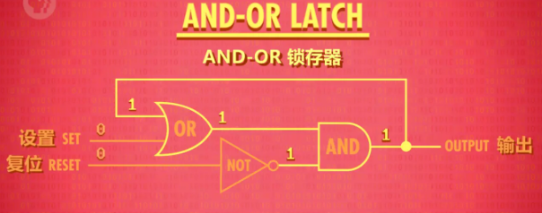

**门锁**：锁存器需要同时输入 2 个数字，不太方便。
为了使用更方便，只用 1 根电线控制数据输入，用另一根电线来控制锁存器是否可以写入，发展了门锁这个器件。

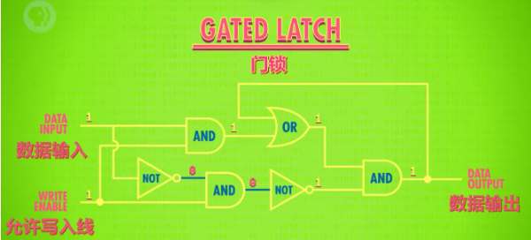

**寄存器（Register）**：
   - 寄存器是一组锁存器的集合，用于存储和处理二进制数据。通常，一个寄存器能够存储多位二进制数，例如8位或16位。
   - 寄存器用于在计算机中执行各种操作，如运算、数据传输和暂时存储指令等。它们是计算机中的关键组成部分，用于执行各种任务。

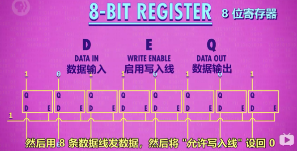

**门锁矩阵**
   - 这些寄存器被按行列排列在一个矩阵中，形成一个二维的结构。通常，这个矩阵是一个矩形，行和列的数量可以根据计算机的设计而异。例如，一个16x16的矩阵包含16行和16列，总共256个寄存器。

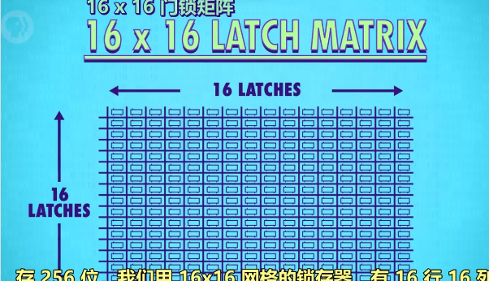

**位址（Address）**：
   - 位址是指内存中的特定位置或单元的唯一标识符。在计算机内存中，每个存储单元都有一个唯一的地址，用于定位和访问存储在该单元中的数据。
   - 位址通常是一个数字或一组数字，用于指示内存中的特定位置。例如，如果内存有256个存储单元，每个单元可以通过一个唯一的8位地址来访问。

**多路复用器（Multiplexer，MUX）**：
   - 多路复用器是一种数字电路组件，用于将多个输入信号中的一个选择并输出到单一输出线上。它根据控制信号来选择哪个输入信号将被传递到输出。
   - 多路复用器的常见用途之一是在内存或寄存器中选择特定的数据单元，以便读取或写入数据。它允许多个输入共享一个输出。

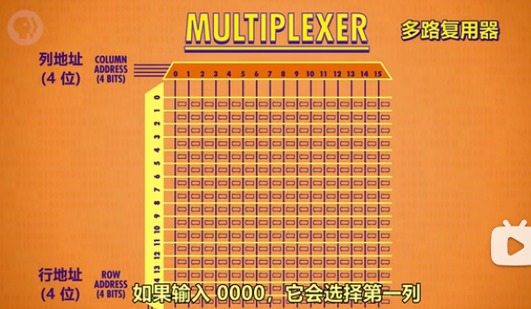

**内存（Memory）**：
   - 内存是计算机系统中用于存储数据和程序的关键组件。它通常分为主内存（主存）和辅助内存（辅存）。
   - 主内存是计算机中用于临时存储数据和程序的地方。它包括RAM（随机存取存储器）和ROM（只读存储器），其中RAM是可读写的，而ROM只读。
   - 辅助内存通常指硬盘驱动器、固态驱动器等永久存储设备，用于长期存储数据和程序。
   - 内存是计算机系统中执行程序和操作数据的关键部分，它提供了快速的数据访问和临时存储。

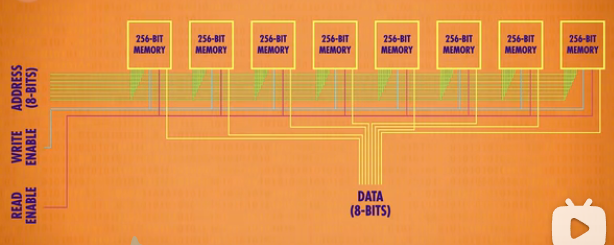

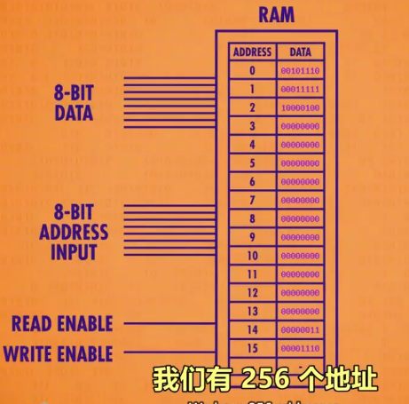

## 中央处理器（CPU）

第七课：中央处理器（CPU）

1. 概念梳理

   - CPU（Central Processing Unit，中央处理单元）是负责执行计算机程序的核心部件。
   - 典型的 CPU 由寄存器、控制单元、ALU（Arithmetic Logic Unit，算术逻辑单元）、时钟组成。
   - CPU 与 RAM（Random Access Memory，随机存取存储器）协同工作，执行计算机程序。
   - CPU 与 RAM 之间通过地址线、数据线和允许读/写线进行通信。
   - 指令是计算机程序的基本构建块，它们指示计算机执行特定操作，包括数学指令和内存指令。
   - 时钟是管理 CPU 运行节奏的关键部件，以精确的间隔触发电信号，控制单元使用这些信号推动 CPU 内部操作。
   - 时钟速度是 CPU 执行每一步操作（取指令、解码、执行）的速度，单位是赫兹（Hz），表示频率。
   - 超频是修改时钟速度以加快 CPU 速度的过程，但过度超频可能导致过热或数据错误。
   - 降频是降低时钟速度以节省电力，对于笔记本电脑和手机等移动设备尤为重要。
   - 微体系结构是从高层次视角看计算机的方式，用于理解各组件之间的抽象连接。

2. CPU 工作原理

   - 必要组件：
     - 指令表：为 CPU 支持的所有指令分配唯一的标识符（ID）。
     - 控制单元：类似于指挥部，按顺序控制指令的读取、执行和写入。
     - 指令地址寄存器：类似于银行取号，顺序通报地址，用于指导 RAM 提供指令。
     - 指令寄存器：存储当前执行的指令代码。

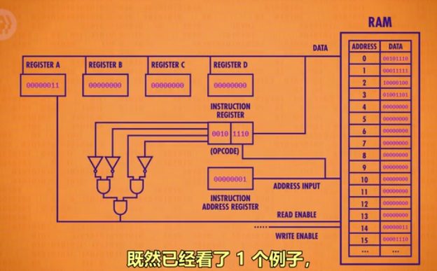

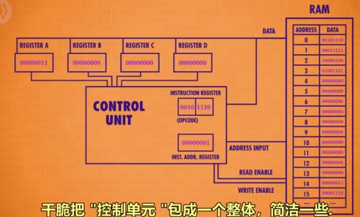

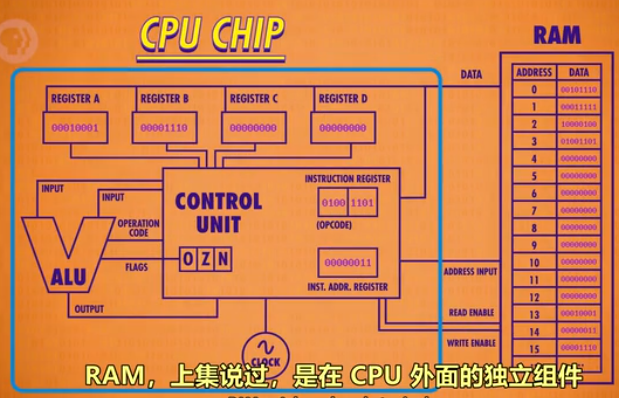

   - CPU 工作过程：
     - 取指令阶段：
       - 指令地址寄存器发出要访问的指令地址给 RAM。
       - RAM 返回该地址内的指令数据到指令寄存器。
     - 解码阶段：
       - 指令寄存器根据数据内容发送指令给控制单元。
       - 控制单元解码指令，确定操作码。
     - 执行阶段：
       - 控制单元执行指令，可能涉及计算。
       - 控制单元调用所需的寄存器和 ALU，传递输入和操作码给 ALU。
       - 控制单元请求 RAM 提供特定地址的数据。
       - RAM 将结果传递给寄存器。
     - 指令地址寄存器自动加1，以便继续执行下一条指令。

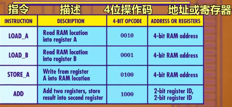

CPU（Central Processing Unit，中央处理单元）是计算机中的核心组件之一，它被认为是计算机的大脑。CPU 负责执行计算机程序中的指令，协调和控制计算机的各种操作。它可以执行各种计算、逻辑操作和数据处理任务，包括算术运算、逻辑判断、数据移动和存储等。

CPU 的时钟速度以赫兹（Hz）为单位表示，它决定了 CPU 在单位时间内执行指令的速度。高时钟速度通常意味着更快的计算能力。

## 指令和程序

1. 概念梳理

   - **指令**：指示计算机要执行的操作的代码，以机器码的形式存在，多条指令共同组成程序。指令可以包括数学指令和内存指令。在计算机内存中，指令和数据都存储在同一个内存中。
   
   - **指令集**：记录了计算机可执行的指令的名称、用法、操作码以及所需的RAM地址位数的表格。

   - **程序**：由一系列指令组成的计算机程序，它们按照特定顺序执行以完成特定任务。

2. 指令的执行原则

   - 特定的数字组合表示一条指令，否则表示一个值。
   
   - **LOAD指令**：用于读取RAM中的指令或数据，将数据通过数据线传输到指定的寄存器（例如，LOAD_A将数据传输到寄存器A）。

   - **ADD指令**：告诉ALU（算术逻辑单元）将两个寄存器中的数字相加，然后将结果存储在指定的寄存器中（例如，ADD B A将寄存器B和寄存器A中的数字相加，并将结果存储在寄存器A中）。

   - **JUMP指令**：用于控制程序的流程，使程序跳转到指定的RAM地址处读取指令或数据。JUMP指令可以是有条件跳转（例如，JUMP-negative）或无条件跳转。

3. 计算机指令长度

   - 早期计算机中，每个字（word）通常只有8位，因此指令长度受到限制，通常只有4位，这意味着只能有16种不同的指令，这远远不够。

   - 现代计算机解决指令长度不足的问题有两种方式：
     - **增加位数**：使用更多的位来表示指令，例如，32位或64位指令集，这样可以支持更多指令。
     - **可变指令长度**：允许不同的指令具有不同的长度，以尽量节省位数。例如，如果某个指令不需要操作内存，则可以省略寻址的位数。某些指令后面需要跟立即值（immediate value），例如JUMP指令。

这些概念帮助理解了计算机指令和程序的基本原理，以及如何通过不同的方式来扩展和优化指令集以适应不同的计算需求。

## 高级CPU设计

1. 概念梳理

   - **缓存**：CPU内的小型RAM存储，用于临时存放批量指令或数据，以提高访问速度。
   - **缓存命中**：当需要的数据已经存在于缓存中时，发生缓存命中，加速访问。
   - **缓存未命中**：当需要的数据不在缓存中，需要从主内存（RAM）中读取。
   - **脏位**：缓存中的每个块都有一个特殊标记，称为脏位，用于检测缓存内的数据是否与RAM一致。
   - **多核处理器**：一个CPU芯片内集成多个独立的处理单元，允许并行执行多个任务。

2. 现代CPU如何提升性能

   - 早期通过提高晶体管速度来提升CPU速度，但这方法有限。
   - 现代CPU采用专门的电路，如除法电路和其他电路，来执行复杂操作，如游戏和视频解码。

3. 缓存

   - 缓存用于存储数据，以避免CPU等待数据传输。它在CPU内部设置，使RAM能够一次性传输一批数据到CPU。
   - 缓存还可用作临时存储中间计算结果，特别适用于长时间或复杂的计算任务。
   - **脏位**用于标记缓存中与RAM不一致的数据。

4. 缓存同步

   - 缓存同步通常在缓存已满但CPU需要输入数据时发生。标记为脏位的数据首先传输回RAM，以腾出缓存空间，以免数据被覆盖，从而导致计算错误。

5. 指令流水线

   - 指令流水线是一种并行处理技术，允许取址、解码和执行三个步骤同时进行，从而提高CPU性能。
   - 难点包括**数据依赖性**和**跳转指令**的处理，解决方法包括**乱序运行**和**分支预测**。

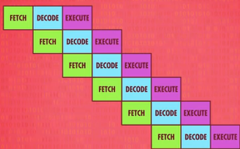

6. 一次性处理多条指令

   - 现代CPU能够同时处理多条指令，通过并行执行来提高性能。
   - 超标量处理器（Superscalar Processor）是一种高性能的CPU架构，它具有能够同时执行多条指令的能力，从而提高计算机的指令吞吐量和性能。这种处理器与传统的标量处理器相比具有更高的并行性。

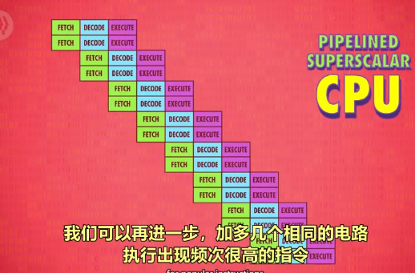

7. 同时运行多个指令流（多核CPU）

   - 多核处理器在一个CPU芯片中集成多个独立的处理单元，每个核心可以执行不同的任务。
   - 核心之间可以共享一些资源，提高多核CPU的整体性能。

8. 超级计算机

   - 超级计算机利用数千个CPU执行复杂的计算任务，如模拟宇宙形成等，以达到极高的性能和计算能力。

## 早期的编程方式

1. **早期的编程方式**

   - 早期，计算机程序必须由人工输入到计算机中。
   
   - 计算机没有内存的概念，因此人们使用物理手段来输入数据（数字）到计算机中。

2. **早期计算机的编程方式**

   - **打孔纸卡/纸带**：人们在纸卡上打孔，通过读卡器读取连通电路，以编写程序。这是早期计算机编程的一种方式。穿孔纸卡具有成本低、可靠性高和易于理解等优点。

   - **插线板**：通过插拔线路的方式，人们可以改变器件之间的连接方式，从而编写程序。

   - **面板开关**（1980s前）：人们通过拨动面板上的开关来进行编程。他们输入二进制操作码，按下存储按钮，推进至下一个内存位，重复这个过程直至操作完内存，然后按运行键执行程序。这适用于内存式电脑。

3. **现代计算机基础结构 - 冯诺依曼计算机**

   - 冯诺依曼计算机是一种具有标志性特征的计算机体系结构，包括以下关键组件：
     - **处理器**：包括算术逻辑单元（ALU）等，用于执行计算任务。
     - **数据寄存器**：用于存储数据。
     - **指令寄存器**：用于存储当前执行的指令。
     - **指令地址寄存器**：用于存储下一条指令的地址。
     - **内存**：用于存储程序和数据。

冯诺依曼计算机的特点是，它将程序和数据都存储在内存中，并通过指令来控制计算机的操作。这个基本架构成为现代计算机的基础，允许存储和执行各种不同的程序，使计算机变得非常灵活和通用。

## 编程语言发展史

