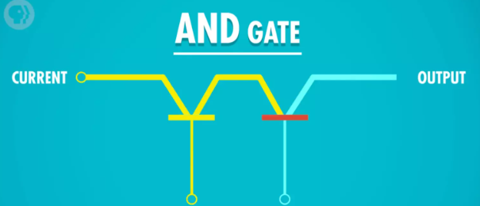
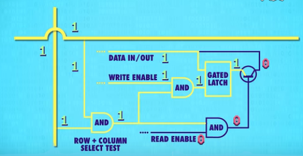

<!-- @import "[TOC]" {cmd="toc" depthFrom=1 depthTo=6 orderedList=false} -->

<!-- code_chunk_output -->

- [计算机早期历史时间线：](#计算机早期历史时间线)
- [电子计算机发展史](#电子计算机发展史)
- [布尔逻辑和逻辑门](#布尔逻辑和逻辑门)
- [二进制](#二进制)
- [算术逻辑单元](#算术逻辑单元)
- [寄存器与内存](#寄存器与内存)
- [中央处理器（CPU）](#中央处理器cpu)
- [指令和程序](#指令和程序)
- [高级CPU设计](#高级cpu设计)
- [早期的编程方式](#早期的编程方式)
- [编程语言发展史](#编程语言发展史)
- [编程原理-语句和函数](#编程原理-语句和函数)
- [算法入门](#算法入门)
- [数据结构](#数据结构)
- [阿兰图灵](#阿兰图灵)
- [软件工程](#软件工程)
- [集成电路和摩尔定律](#集成电路和摩尔定律)
- [操作系统](#操作系统)
- [内存和存储介质](#内存和存储介质)
- [文件系统](#文件系统)
- [压缩](#压缩)
- [命令行界面](#命令行界面)
- [屏幕\&2D 图像显示](#屏幕2d-图像显示)
- [冷战和消费主义](#冷战和消费主义)
- [个人计算机革命](#个人计算机革命)

<!-- /code_chunk_output -->

[B站-计算机速成](https://www.bilibili.com/video/BV1EW411u7th/?vd_source=df35f9f0eb3432ee06a5f67e4c43f835)
笔记
## 计算机早期历史时间线：

公元前2500年：
- 算盘出现，是一种十进制计算工具，类似于一个计数器。

公元前2500年 - 公元1500年：
- 出现依靠机械运动的计算设备，如星盘和计算尺。

公元1613年：
- 出现"computer"的概念，当时指的是专门从事计算工作的职业。

1694年：
- 步进计算器问世，是世界上第一台能够自动完成加法、减法、乘法和除法运算的计算器。

1694年 - 1900年：
- 计算表兴起，类似于字典，可用于查找各种复杂的计算值。

1823年：
- 出现差分机的设想，这种设备可以进行函数计算，但最终计划失败。
- 旨在自动执行多项式计算。差分机使用了齿轮和杠杆系统，可以进行基本的数学运算，如加法和减法。这个设备的设计概念为后来的计算机奠定了基础。

19世纪中期：
- 分析机的设想出现，人们设想存在一种通用计算机，可以计算一切。
- 分析机使用穿孔卡片来编程和输入数据，这一思想在后来的计算机中得到了延续。

1890年：
- 打孔卡片制表机问世，其原理是在纸卡上打孔，孔穿过针，针泡入汞，从而完成电路连接，齿轮使计数器增加1。
- 赫尔曼·何乐礼发明了一种打孔卡片制表机，用于处理和分析大量数据，特别是在人口普查等大规模统计工作中。这些机器使用打孔卡片作为数据输入，通过读取卡片上的孔来执行各种计算任务。何乐礼的发明最终导致了计算机技术的商业化应用，创立了IBM公司。

这些里程碑事件标志着计算机技术的演进，从最早的计数工具到通用计算机的概念的逐渐发展，为现代计算机的诞生奠定了基础。

## 电子计算机发展史

电子计算机的发展历程：

**电子计算机元器件的演进：**
   - 从早期的**继电器**，到后来的**真空管**，再到更可靠的**晶体管**，电子计算机的元器件逐步演进，为计算性能的提升和计算机的可靠性奠定了基础。

**计算机的出现背景：**
   - 20世纪，人口急剧增加，科学和工程领域迅速发展，航天计划等项目加速进行，导致数据复杂度激增和计算需求急剧上升，促使了对自动化和高速计算的紧迫需求。

**电子计算机的发展历程：**
   - 从1940年代初期的继电器计算机和早期的真空管计算机，如哈佛马克1和巨人1号，到ENIAC成为第一台通用计算机的代表，再到晶体管的问世，电子计算机的发展经历了重要阶段。最终，晶体管技术的引入标志着电子计算机元器件的现代化，为计算机技术的商业化应用铺平了道路。

继电器、真空管和晶体管都是电子元件，用于控制电流的流动和电信号的处理。下面是它们的工作原理的简单通俗解释：

1. **继电器：**
   - 继电器就像一个电磁开关。当电流通过继电器的线圈时，线圈中产生一个电磁场，这会吸引一个可移动的金属片（触点）。当金属片被吸引时，触点闭合，允许电流通过继电器的主电路。
   - 这就好像你按下开关来控制灯的亮灭一样。继电器的工作原理类似，只不过是使用电磁力来打开或关闭电路。

2. **真空管：**
   - 真空管是一个真空密封的玻璃管内有电极的设备。在管内抽取空气，创建真空后，电子从一个电极（阴极）发射出来，经过真空中的空间，然后被另一个电极（阳极）吸引，从而形成电流。
   - 真空管的工作原理类似于电子的"阀门"，可以控制电子流的开启和关闭，因此它可以用来放大信号或执行开关操作。
   - 二极管就像一个电子流的"阀门"，只允许电流在一个方向上流动，通常被称为正向导通。
   - 三极管是一种更复杂的半导体器件，通常有三个电极：发射极、基极和集电极。

3. **晶体管：**
   - 晶体管是一个半导体元件，通常是硅或其他材料制成。它有三个电极：发射极、基极和集电极。晶体管的行为受到基极电流的控制。
   - 当在基极加电流时，它控制了发射极和集电极之间的电流流动。这种控制是通过**半导体**中的电子和空穴的运动来实现的，从而调节了整个晶体管的电流。
   - 晶体管的工作原理类似于一个电流控制的"开关"，通过控制输入信号电流来调整输出信号电流，使其可以用来放大信号、执行逻辑操作和存储信息。

总的来说，继电器通过电磁吸引控制电路的开关，真空管利用电子在真空中的流动，而晶体管通过半导体材料中的电子流动和控制来实现电流的调节。这些元件在电子设备中扮演着不同但关键的角色。

## 布尔逻辑和逻辑门

key：布尔代数

以下是关于布尔逻辑、逻辑门和二进制在计算机中的应用的整理：

**1. 为什么计算机使用二进制：**
- 计算机的元器件，如晶体管，只有两种状态：通电（1）和断电（0）。使用二进制可以直接映射到这两种状态，从而设计计算机。
- **布尔代数**是数学的一个分支，使用True（1）和False（0）进行逻辑运算，而不是使用实数，这与计算机中的数据表示方式相匹配。
- 计算的状态越多，信号混淆的可能性就越高，这会影响计算的准确性。使用二进制可以减少混淆。

**2. 布尔代数和逻辑门：**
- 布尔代数中只有两个变量：True（1）和False（0），没有常数。
- 布尔代数有三个基本操作：NOT、AND和OR，分别对应着逻辑门中的非门、与门和或门。
- 布尔代数中的这些操作允许进行逻辑运算，帮助计算机做出决策和执行各种任务。

**3. 逻辑门和晶体管的实现：**
- 逻辑门是逻辑运算的基本组成单元，可以由晶体管构建。晶体管充当开关，控制电流的流动。
- NOT门（非门）：将输入布尔值反转，使用半导体通电和不通电的方式实现，将输入的True变成False，反之亦然。

- AND门（与门）：仅当两个输入都为True时，输出为True，使用串联两个晶体管来实现。

- OR门（或门）：只要输入中至少有一个True，输出为True，使用并联两个晶体管来实现。

**4. 异或门（XOR门）：**
- XOR门（异或门）是一种特殊的逻辑门，其输出只在两个输入中仅有一个True时为True，其余情况输出为False。
- 异或门可以通过组合OR门、AND门和NOT门来构建，通过这些门的逻辑组合，实现了异或操作。

总的来说，布尔逻辑、逻辑门和二进制是计算机中基本的概念和工具，它们帮助计算机执行各种复杂的任务，从基本的逻辑运算到高级的数据处理和决策。逻辑门的构建基于晶体管等元器件的工作原理，通过它们的组合可以实现各种逻辑操作。

## 二进制

**1. 二进制原理和存储单位：**
- 二进制是计算机中的基本表示方式，只包含数字1和0，每位称为位（bit）。
- 1字节（byte）等于8位（8 bits），是计算机中的基本存储单元。
- 存储单位：
  - 1MB（兆字节）= 2^20 字节
  - 1GB（千兆字节）= 2^30 字节
  - 1TB（千兆兆字节）= 2^40 字节

**2. 十进制与二进制的区别和联系：**
- 十进制有10个数字（0-9），每向左进一位数字增加10倍。
- 二进制有2个数字（0-1），每向左进一位数字增加2倍。
- 联系：通过提取位数并分别计算，将十进制数转换为二进制数，反之亦然。

**3. 32位与64位计算机的区别：**
- 32位计算机的最大表示范围约为43亿左右，32位能表示的数字范围是0到2^32 - 1。
- 64位计算机的最大表示范围远远超过32位，能表示更大的数字范围，大约是9.2 x 10^18。

**4. 数字表示方法：**
- 整数：第1位表示正负，其余位存储实际数值（采用补码表示负数）。
- 浮点数：采用IEEE 754标准表示，分为符号位、指数位和有效位，用于存储小数。

**5. ASCII（美国信息交换标准代码）：**
- 用数字编号表示英文字母和符号，有128个不同的值。
- 7位二进制代码表示每个字符。

**6. Unicode：**
- 用于统一所有字符编码的标准，于1992年诞生。
- Unicode包含17个16位数字的组，可表示超过100万个字符，以满足各种语言的需求。

## 算术逻辑单元

ALU（算术逻辑单元）是计算机中的一个关键组件，它是计算机中的核心部分之一，负责执行数字和逻辑运算。ALU可以执行各种数学运算（如加法、减法、乘法、除法）以及逻辑运算（如AND、OR、NOT、XOR等），是计算机进行各种计算和决策的基本单元。

ALU通常包括两个主要部分：

1. **算术单元（Arithmetic Unit）：** 这部分负责执行数学运算，如加法和减法。它可以接收输入的数字数据，执行相应的数学运算，并产生输出结果。

2. **逻辑单元（Logic Unit）：** 这部分负责执行逻辑运算，如逻辑与（AND）、逻辑或（OR）、逻辑非（NOT）以及逻辑异或（XOR）。逻辑单元用于处理逻辑判断和条件运算。

在计算机体系结构中，ALU通常与寄存器文件（Register File）和控制单元（Control Unit）一起工作，以执行各种指令和操作。

算术逻辑单元（ALU）中的算术单元是计算机中的一个关键组成部分，负责执行各种数学运算，如加法、减法、乘法、除法等。以下是有关ALU中算术单元的详细笔记：

**算术单元的基本组成：**
1. **半加器（Half Adder）：**
   - 半加器是算术单元的基本构建块之一。
   - 它用于执行最低位的加法运算，即两个单独的二进制位相加。
   - 输入包括两个二进制位（A和B），输出包括两个部分：
     - 总和（Sum）：A和B的和。
     - 进位（Carry）：在相加时是否产生了进位（如果A和B都为1，则会产生进位）。

2. **全加器（Full Adder）：**
   - 全加器用于执行多位数的加法运算，处理了进位的情况。
   - 输入包括两个二进制位（A和B）以及一个来自上一位的进位信号（C_in）。
   - 输出包括两个部分：
     - 总和（Sum）：A、B和进位信号的总和。
     - 进位（Carry）：在相加时是否产生了进位（用于传递给下一位）。

**8位数的加法：**
- 为了执行8位数的加法，可以通过连接1个半加器和7个全加器来实现。每个全加器的输入包括A、B和前一个全加器的进位信号，输出包括总和和进位信号。

**超前进位加法器（Carry-Lookahead Adder）：**
- 现代计算机使用超前进位加法器来提高加法性能。
- 超前进位加法器可以预先计算出进位信号，从而加速加法运算，而不需要等待进位信号从低位传递到高位。

**其他支持的运算：**
- 算术单元不仅支持加法运算，还支持减法、乘法和除法等数学运算。
- 这些运算通常通过多次使用加法运算来实现，例如，乘法可以看作是多次执行加法，而减法可以通过加法和取反操作来实现。

**溢出概念：**
- 溢出是指在有限位数的表示范围内无法容纳结果的情况。
- 对于加法运算，如果最高位的进位为1，表示溢出，需要特殊处理。

ALU（算术逻辑单元）中的逻辑单元负责执行逻辑操作，如AND、OR、NOT等，以及进行简单的数值测试。以下是关于ALU中逻辑单元的笔记：

**1. 逻辑单元的基本功能：**
   - 逻辑单元执行各种逻辑运算，包括布尔代数运算和位级运算。
   - 它处理二进制数据，对输入数据进行逻辑操作，并生成相应的输出。

**2. 常见逻辑运算：**
   - **AND操作：** 逻辑AND操作将两个输入位相乘，只有当两个位都为1时，输出才为1，否则为0。
   - **OR操作：** 逻辑OR操作将两个输入位相加，只要有一个位为1，输出就为1，否则为0。
   - **NOT操作：** 逻辑NOT操作将输入位取反，即0变为1，1变为0。
   - **XOR操作：** 逻辑XOR（异或）操作将两个输入位进行异或运算，只有当两个位不相等时，输出才为1，否则为0。

**3. 逻辑单元的输出：**
   - 逻辑单元的输出通常是一个或多个位，表示运算的结果。
   - 这些输出位可以被传递到其他部件，如寄存器或存储单元，以供后续计算或操作使用。

ALU的抽象

作用： ALU的抽象使工程师不必考虑逻辑门层面的具体组成，从而简化了工作。
图示： ALU通常用一个大的“V”符号表示，包括输入A、输入B以及输出和标志输出（如溢出、零、负数标志）。
ALU是计算机中的关键部件，它的运算能力和灵活性对计算机的性能和功能起着至关重要的作用。理解ALU的工作原理对于计算机科学和工程领域的学生和专业人士都是非常重要的。

## 寄存器与内存

**锁存器（Latch）**：
   - 锁存器是一种电子电路元件，用于存储一个位（通常是0或1）。它通过逻辑门（通常是AND、OR、NOT门）的组合来实现。
   - 锁存器有两个主要状态，称为设置（set）和复位（reset）。当设置状态激活时，锁存器会保持高电平，当复位状态激活时，它会保持低电平。
   - 锁存器通常用于构建更复杂的数字电路，如寄存器和内存。

**门锁**：锁存器需要同时输入 2 个数字，不太方便。
为了使用更方便，只用 1 根电线控制数据输入，用另一根电线来控制锁存器是否可以写入，发展了门锁这个器件。

**寄存器（Register）**：
   - 寄存器是一组锁存器的集合，用于存储和处理二进制数据。通常，一个寄存器能够存储多位二进制数，例如8位或16位。
   - 寄存器用于在计算机中执行各种操作，如运算、数据传输和暂时存储指令等。它们是计算机中的关键组成部分，用于执行各种任务。

**门锁矩阵**
   - 这些寄存器被按行列排列在一个矩阵中，形成一个二维的结构。通常，这个矩阵是一个矩形，行和列的数量可以根据计算机的设计而异。例如，一个16x16的矩阵包含16行和16列，总共256个寄存器。

**位址（Address）**：
   - 位址是指内存中的特定位置或单元的唯一标识符。在计算机内存中，每个存储单元都有一个唯一的地址，用于定位和访问存储在该单元中的数据。
   - 位址通常是一个数字或一组数字，用于指示内存中的特定位置。例如，如果内存有256个存储单元，每个单元可以通过一个唯一的8位地址来访问。

**多路复用器（Multiplexer，MUX）**：
   - 多路复用器是一种数字电路组件，用于将多个输入信号中的一个选择并输出到单一输出线上。它根据控制信号来选择哪个输入信号将被传递到输出。
   - 多路复用器的常见用途之一是在内存或寄存器中选择特定的数据单元，以便读取或写入数据。它允许多个输入共享一个输出。

**内存（Memory）**：
   - 内存是计算机系统中用于存储数据和程序的关键组件。它通常分为主内存（主存）和辅助内存（辅存）。
   - 主内存是计算机中用于临时存储数据和程序的地方。它包括RAM（随机存取存储器）和ROM（只读存储器），其中RAM是可读写的，而ROM只读。
   - 辅助内存通常指硬盘驱动器、固态驱动器等永久存储设备，用于长期存储数据和程序。
   - 内存是计算机系统中执行程序和操作数据的关键部分，它提供了快速的数据访问和临时存储。

## 中央处理器（CPU）

第七课：中央处理器（CPU）

1. 概念梳理

   - CPU（Central Processing Unit，中央处理单元）是负责执行计算机程序的核心部件。
   - 典型的 CPU 由寄存器、控制单元、ALU（Arithmetic Logic Unit，算术逻辑单元）、时钟组成。
   - CPU 与 RAM（Random Access Memory，随机存取存储器）协同工作，执行计算机程序。
   - CPU 与 RAM 之间通过地址线、数据线和允许读/写线进行通信。
   - 指令是计算机程序的基本构建块，它们指示计算机执行特定操作，包括数学指令和内存指令。
   - 时钟是管理 CPU 运行节奏的关键部件，以精确的间隔触发电信号，控制单元使用这些信号推动 CPU 内部操作。
   - 时钟速度是 CPU 执行每一步操作（取指令、解码、执行）的速度，单位是赫兹（Hz），表示频率。
   - 超频是修改时钟速度以加快 CPU 速度的过程，但过度超频可能导致过热或数据错误。
   - 降频是降低时钟速度以节省电力，对于笔记本电脑和手机等移动设备尤为重要。
   - 微体系结构是从高层次视角看计算机的方式，用于理解各组件之间的抽象连接。

2. CPU 工作原理

   - 必要组件：
     - 指令表：为 CPU 支持的所有指令分配唯一的标识符（ID）。
     - 控制单元：类似于指挥部，按顺序控制指令的读取、执行和写入。
     - 指令地址寄存器：类似于银行取号，顺序通报地址，用于指导 RAM 提供指令。
     - 指令寄存器：存储当前执行的指令代码。

   - CPU 工作过程：
     - 取指令阶段：
       - 指令地址寄存器发出要访问的指令地址给 RAM。
       - RAM 返回该地址内的指令数据到指令寄存器。
     - 解码阶段：
       - 指令寄存器根据数据内容发送指令给控制单元。
       - 控制单元解码指令，确定操作码。
     - 执行阶段：
       - 控制单元执行指令，可能涉及计算。
       - 控制单元调用所需的寄存器和 ALU，传递输入和操作码给 ALU。
       - 控制单元请求 RAM 提供特定地址的数据。
       - RAM 将结果传递给寄存器。
     - 指令地址寄存器自动加1，以便继续执行下一条指令。

CPU（Central Processing Unit，中央处理单元）是计算机中的核心组件之一，它被认为是计算机的大脑。CPU 负责执行计算机程序中的指令，协调和控制计算机的各种操作。它可以执行各种计算、逻辑操作和数据处理任务，包括算术运算、逻辑判断、数据移动和存储等。

CPU 的时钟速度以赫兹（Hz）为单位表示，它决定了 CPU 在单位时间内执行指令的速度。高时钟速度通常意味着更快的计算能力。

## 指令和程序

1. 概念梳理

   - **指令**：指示计算机要执行的操作的代码，以机器码的形式存在，多条指令共同组成程序。指令可以包括数学指令和内存指令。在计算机内存中，指令和数据都存储在同一个内存中。
   
   - **指令集**：记录了计算机可执行的指令的名称、用法、操作码以及所需的RAM地址位数的表格。

   - **程序**：由一系列指令组成的计算机程序，它们按照特定顺序执行以完成特定任务。

2. 指令的执行原则

   - 特定的数字组合表示一条指令，否则表示一个值。
   
   - **LOAD指令**：用于读取RAM中的指令或数据，将数据通过数据线传输到指定的寄存器（例如，LOAD_A将数据传输到寄存器A）。

   - **ADD指令**：告诉ALU（算术逻辑单元）将两个寄存器中的数字相加，然后将结果存储在指定的寄存器中（例如，ADD B A将寄存器B和寄存器A中的数字相加，并将结果存储在寄存器A中）。

   - **JUMP指令**：用于控制程序的流程，使程序跳转到指定的RAM地址处读取指令或数据。JUMP指令可以是有条件跳转（例如，JUMP-negative）或无条件跳转。

3. 计算机指令长度

   - 早期计算机中，每个字（word）通常只有8位，因此指令长度受到限制，通常只有4位，这意味着只能有16种不同的指令，这远远不够。

   - 现代计算机解决指令长度不足的问题有两种方式：
     - **增加位数**：使用更多的位来表示指令，例如，32位或64位指令集，这样可以支持更多指令。
     - **可变指令长度**：允许不同的指令具有不同的长度，以尽量节省位数。例如，如果某个指令不需要操作内存，则可以省略寻址的位数。某些指令后面需要跟立即值（immediate value），例如JUMP指令。

这些概念帮助理解了计算机指令和程序的基本原理，以及如何通过不同的方式来扩展和优化指令集以适应不同的计算需求。

## 高级CPU设计

1. 概念梳理

   - **缓存**：CPU内的小型RAM存储，用于临时存放批量指令或数据，以提高访问速度。
   - **缓存命中**：当需要的数据已经存在于缓存中时，发生缓存命中，加速访问。
   - **缓存未命中**：当需要的数据不在缓存中，需要从主内存（RAM）中读取。
   - **脏位**：缓存中的每个块都有一个特殊标记，称为脏位，用于检测缓存内的数据是否与RAM一致。
   - **多核处理器**：一个CPU芯片内集成多个独立的处理单元，允许并行执行多个任务。

2. 现代CPU如何提升性能

   - 早期通过提高晶体管速度来提升CPU速度，但这方法有限。
   - 现代CPU采用专门的电路，如除法电路和其他电路，来执行复杂操作，如游戏和视频解码。

3. 缓存

   - 缓存用于存储数据，以避免CPU等待数据传输。它在CPU内部设置，使RAM能够一次性传输一批数据到CPU。
   - 缓存还可用作临时存储中间计算结果，特别适用于长时间或复杂的计算任务。
   - **脏位**用于标记缓存中与RAM不一致的数据。

4. 缓存同步

   - 缓存同步通常在缓存已满但CPU需要输入数据时发生。标记为脏位的数据首先传输回RAM，以腾出缓存空间，以免数据被覆盖，从而导致计算错误。

5. 指令流水线

   - 指令流水线是一种并行处理技术，允许取址、解码和执行三个步骤同时进行，从而提高CPU性能。
   - 难点包括**数据依赖性**和**跳转指令**的处理，解决方法包括**乱序运行**和**分支预测**。

6. 一次性处理多条指令

   - 现代CPU能够同时处理多条指令，通过并行执行来提高性能。
   - 超标量处理器（Superscalar Processor）是一种高性能的CPU架构，它具有能够同时执行多条指令的能力，从而提高计算机的指令吞吐量和性能。这种处理器与传统的标量处理器相比具有更高的并行性。

7. 同时运行多个指令流（多核CPU）

   - 多核处理器在一个CPU芯片中集成多个独立的处理单元，每个核心可以执行不同的任务。
   - 核心之间可以共享一些资源，提高多核CPU的整体性能。

8. 超级计算机

   - 超级计算机利用数千个CPU执行复杂的计算任务，如模拟宇宙形成等，以达到极高的性能和计算能力。

## 早期的编程方式

1. **早期的编程方式**

   - 早期，计算机程序必须由人工输入到计算机中。
   
   - 计算机没有内存的概念，因此人们使用物理手段来输入数据（数字）到计算机中。

2. **早期计算机的编程方式**

   - **打孔纸卡/纸带**：人们在纸卡上打孔，通过读卡器读取连通电路，以编写程序。这是早期计算机编程的一种方式。穿孔纸卡具有成本低、可靠性高和易于理解等优点。

   - **插线板**：通过插拔线路的方式，人们可以改变器件之间的连接方式，从而编写程序。

   - **面板开关**（1980s前）：人们通过拨动面板上的开关来进行编程。他们输入二进制操作码，按下存储按钮，推进至下一个内存位，重复这个过程直至操作完内存，然后按运行键执行程序。这适用于内存式电脑。

3. **现代计算机基础结构 - 冯诺依曼计算机**

   - 冯诺依曼计算机是一种具有标志性特征的计算机体系结构，包括以下关键组件：
     - **处理器**：包括算术逻辑单元（ALU）等，用于执行计算任务。
     - **数据寄存器**：用于存储数据。
     - **指令寄存器**：用于存储当前执行的指令。
     - **指令地址寄存器**：用于存储下一条指令的地址。
     - **内存**：用于存储程序和数据。

冯诺依曼计算机的特点是，它将程序和数据都存储在内存中，并通过指令来控制计算机的操作。这个基本架构成为现代计算机的基础，允许存储和执行各种不同的程序，使计算机变得非常灵活和通用。

## 编程语言发展史

1. 伪代码：
   - 定义：伪代码是一种高层次的程序描述方法，使用自然语言（如中文或英语）来描述程序的逻辑。
   - 作用：用于程序设计的初步规划和理解，不直接可执行，但有助于开发人员理清思路。

2. 汇编器：
   - 定义：汇编器是一种工具，用于将汇编语言代码转换为机器语言代码。每条汇编语句对应一条机器指令。
   - 作用：汇编器帮助程序员将可读性更高的汇编语言转化为计算机可以执行的机器码。

3. 助记符（汇编器）：
   - 定义：助记符是汇编语言中的简单名字，用来代替复杂的机器码操作码，提高代码可读性。
   - 作用：使程序员更容易理解和编写汇编语言代码。

4. 早期二进制编程：
   - 背景：早期计算机编程主要在硬件层面进行，编写程序非常繁琐。
   - 过程：程序员使用伪代码描述程序，然后将其转换为二进制机器码，通过汇编器翻译为可执行代码。

5. 汇编器和助记符的出现：
   - 年代：1940年代到1950年代。
   - 作用：汇编器将汇编语言转换为机器码，助记符提供更可读的指令名称，简化了编程过程。

6. 最早的高级编程语言 - "A-0"：
   - 背景：1950年代，为释放计算机潜力，葛丽丝·霍普设计了高级编程语言 "A-0"。
   - 特点：一行高级编程语言可以转换为多条二进制指令，但当时计算机界认为计算机只能做计算，未广泛使用。

7. 高级编程语言的发展：
   - FORTRAN（1957年）：由IBM发布，将程序长度减小20倍，但仅适用于特定计算机。
   - COBOL（1959年）：通用编程语言，可以在不同机器上运行，主要用于商业应用。

8. 现代编程语言（1960s-2000s）：
   - 1960s：出现LGOL、LISP、BASIC等语言。
   - 1970s：Pascal、C、Smalltalk。
   - 1980s：C++、Objective-C、Perl。
   - 1990s：Python、Ruby、Java等语言。

9. 安全漏洞和补丁：
   - 起源：在1940年代，计算机程序使用打孔纸带进行，出现漏洞时只能贴上胶带（补丁）来修复问题，因此得名。

编程语言的发展历程涵盖了从早期的汇编和机器码到高级编程语言的演进，使编程变得更加高效和可读。

## 编程原理-语句和函数 

1. 变量和赋值语句：
   - 变量：可赋值的量，如将数字5存储在变量a中。
   - 赋值语句：将一个值赋给一个变量的操作，例如a = 5。

2. if语句：
   - 作用：用于条件判断，执行不同的代码块取决于条件的真假。
   - 结构：如果条件X为真，执行代码Y，否则不执行Y。

3. while循环：
   - 作用：当条件满足时进入循环，只要条件保持为真，就会一直执行循环内的代码。
   - 结构：进入循环后，当条件不再满足时跳出循环。

4. for循环：
   - 作用：用于按照特定次数执行循环，不判断条件，而是判断循环次数。
   - 特点：循环结束后，通常会使一个计数器（如i）递增。

5. 函数：
   - 作用：将一段常用的代码封装成一个函数（也叫方法或子程序），以便在程序的其他地方多次使用，只需调用函数名即可。
   - 优点：提高代码的可维护性和重用性，避免重复编写相同的代码。

## 算法入门

1. 基本概念：
   - 算法：解决问题的基本步骤或方法。
   
2. 选择排序：
   - 定义：一种排序算法，对一组数据进行排序。
   - 复杂度：选择排序的复杂度为O(n²)，其中n是需要排序的数据个数。
   
3. 大O表示法：
   - 定义：一种表示**算法复杂度**的标记法，用于描述算法的运行速度与输入大小之间的关系。
   
4. 归并排序：
   - 定义：一种排序算法，其算法复杂度为O(n*log n)。
   - 解释：n表示需要比较和合并的次数，与数组大小成正比；log n表示合并步骤所需的次数，归并排序比选择排序更有效率。
   
5. Dijkstra算法：
   - 复杂度：该算法初始复杂度为O(n²)，后来优化后的复杂度为O(n*log n + I)，其中n表示节点数，I表示边的数量。

## 数据结构

1. 数组：
   - 定义：数组是一种数据结构，也称为列表或向量，用于存储一组有序的元素。
   - 访问方式：通过下标（索引）来访问数组元素，通常从0开始，用方括号 [ ] 表示。
   - 注意：数组中的第5个数对应数组下标为4的元素。

2. 字符串：
   - 定义：字符串是由字母、数字、标点等字符组成的数组，通常以0结尾存储在内存中。

3. 矩阵：
   - 定义：矩阵可以看作是数组的数组，用于表示多维数据。

4. 结构体：
   - 定义：结构体是一种数据结构，用于将多个相关的变量组合在一起。
   
5. 指针：
   - 定义：指针是一种特殊变量，用于存储内存地址。

6. 节点：
   - 定义：节点是一个包含指针变量的结构体，常用于构建链表等数据结构。

7. 链表：
   - 定义：链表是一种灵活的数据结构，由多个节点组成，每个节点指向下一个节点。
   - 特点：链表可以是循环的（最后一个节点指向第一个节点）或非循环的。

8. 队列：
   - 定义：队列是一种数据结构，遵循先进先出（FIFO）原则，类似于排队等待的过程。

9. 栈：
   - 定义：栈是一种数据结构，遵循后进先出（LIFO）原则，类似于一堆松饼。

10. 树：
    - 定义：树是一种分层的数据结构，包括根节点、子节点和叶节点等，用于表示层次关系。

11. 图：
    - 定义：图是一种数据结构，其中数据元素可以任意连接，可能包含循环。

这些数据结构是编程中常用的基本工具，用于组织和存储数据，解决不同类型的问题。理解它们的特性和用途有助于有效地处理各种编程任务。

## 阿兰图灵

1. 可判定性问题：
   - 定义：可判定性问题是指是否存在一种算法，输入正式逻辑语句后，能够准确地输出答案是"是"或"否"。
   - 阿兰·图灵对这类问题进行了深入研究。

2. 阿隆佐·丘奇与Lambda算子：
   - 阿隆佐·丘奇是美国数学家，他开发了一种数学表达系统称为"Lambda算子"。
   - 贡献：丘奇证明了可判定性问题的不存在性，即不可能存在一个通用算法来解决所有可判定性问题。

3. 图灵机的概念：
   - 图灵机是由阿兰·图灵提出的，它是一种理论性的计算模型，具备足够的规则、状态和纸带，能够模拟一切计算问题。
   - 图灵完备：如果一种计算系统和图灵机一样具备计算能力，就被称为图灵完备。

4. 停机问题：
   - 定义：停机问题是一个经典的不可判定性问题，它涉及判断是否存在一个算法能够判断任意程序是否会在有限时间内停机（终止执行）。
   - 结论：图灵机无法解决停机问题，因此停机问题是不可判定的。

5. 图灵测试：
   - 定义：图灵测试是一种测试人工智能是否具备智能的方法，通过向人和计算机同时发送信息，然后判断回答的来源，如果无法区分哪个是人，哪个是计算机，就认为计算机达到了智能程度。

阿兰·图灵的工作和思想对计算机科学和人工智能领域产生了深远的影响。他的研究不仅帮助我们理解计算问题的不可判定性，还推动了人工智能领域的发展和智能测试的概念。

可判定性问题，也称为可决定性问题（decidable problem），是指存在一种算法或计算过程，能够在有限时间内对给定的输入数据进行处理，并给出明确的、确定的答案，答案通常是"是"或"否"。换句话说，对于可判定性问题，存在一种方法可以判断问题的实例是否满足某种性质或条件。

可判定性问题的特点是它们具有确定的、终止的算法解决方案，无论输入数据的规模如何，都可以在有限时间内得到答案。这与不可判定性问题相对，不可判定性问题通常是无法用确定的算法来解决的，或者说不存在一个通用算法，能够对所有可能的问题实例都给出正确的答案。

举例来说，判断一个给定的正整数是否是素数是一个可判定性问题，因为存在一种确定性算法来检查它。另一方面，停机问题（Halting Problem）是一个经典的不可判定性问题，它涉及判断一个程序是否会在有限时间内停机（终止执行），而不存在一个通用算法可以解决所有停机问题实例。因此，停机问题是不可判定的。

## 软件工程

1. 面向对象编程（OOP）：
   - 定义：将大型任务分解成对象，每个对象包含相关函数和变量，以隐藏复杂度，并有选择地公开功能。
   - 核心思想：将函数打包成对象，对象可以包括其他对象，函数和变量。

2. API（应用程序编程接口）：
   - 定义：API是文档和程序接口，用于帮助团队合作和编程。
   - 作用：控制哪些函数和数据可以被外部访问，哪些仅供内部使用。

3. 集成开发环境（IDE）：
   - 定义：IDE是用于编写代码的专门工具，提供代码编辑、调试和其他开发功能。

4. 调试（Debugging）：
   - 定义：调试是通过IDE等工具来检查和解决代码错误的过程，帮助开发者找到和修复问题。

5. 文档与注释：
   - 文档：通常存放在README文件中，用于解释项目的用途、结构和用法。
   - 注释：写在源代码中，是标记过的文字，用于帮助开发者理解代码，编译时会被忽略。

6. 版本控制：
   - 定义：版本控制，又称源代码管理，用于跟踪代码的变化，允许开发者协作，回滚到之前的稳定版本等。
   - 示例：代码仓库，借出、修改、提交代码。

7. 质量控制：
   - 定义：质量保证测试（QA）用于发现和修复软件中的错误（bug）。

8. Beta和Alpha版本：
   - Alpha版：开发早期版本，通常粗糙，只在内部测试。
   - Beta版：接近完成但未经完全测试的版本，有时发布给公众以帮助发现问题。

这些概念和工具是软件开发过程中的重要组成部分，有助于编写、测试、维护和改进软件项目。

## 集成电路和摩尔定律

晶体管和电子管（真空管）、集成电路（IC）、印刷电路板（PCB）、光刻

1. 分立元件与数字暴政：
   - 初始计算机构成：计算机最初由独立的分立元件构成，这些元件通过线连接在一起，导致计算机结构复杂，被称为"数字暴政"问题。

2. 集成电路（IC）与半导体：
   - 集成电路：为了简化计算机构造，多个组件被整合在一个独立的集成电路（IC）中，减少了线连接的复杂性。
   - 半导体材料（通常硅）使集成电路的制造成为可能，由仙童半导体首先将这一理念变为现实。

3. 印刷电路板（PCB）：
   - PCB：为了将零件连接在一起而发明的印刷电路板，通过蚀刻金属线将组件连接起来，替代了焊接或线连接。

4. 光刻：
   - 光刻：一种生产步骤，将复杂图案印刷在材料表面，通常用于制造集成电路。
   - 晶圆：硅的薄片状材料，通过光刻等工艺加工，用于制造集成电路。

5. 摩尔定律：
   - 定义：摩尔定律规定了每两年左右，同样大小的空间能容纳两倍数量的晶体管，反映了计算机硬件性能的快速发展。
   - 发展基础：得益于材料和制造技术的不断进步，摩尔定律一度推动了计算机性能的提升。

6. 小型化带来的问题：
   - 光的波长限制：随着小型化程度的提高，光的波长成为限制因素，制约了进一步的小型化。
   - 量子隧穿效应：当晶体管非常小，电极之间的距离可能只有几个原子，电子可能会通过隧穿效应跳过间隙，导致漏电问题。

这些概念和技术代表了计算机硬件发展的关键里程碑，从分立元件到集成电路，再到摩尔定律的发现，都推动了计算机性能的飞速提升。然而，随着硬件的小型化，也出现了一些新的挑战和问题。

## 操作系统

1. 操作系统简介：
   - 操作系统（Operating System，OS）是一种程序，具有特殊权限，用于运行和管理计算机硬件以及其他应用程序。
   - 操作系统是计算机系统的核心组成部分，它允许用户与硬件进行交互，管理资源，并为其他应用程序提供执行环境。

2. 批处理（Batch Processing）：
   - 批处理是一种自动运行一系列程序的方式，一个程序运行完后自动启动下一个程序。
   - 这种方式通常用于处理大量的任务，而无需用户手动干预。

3. 外部设备与设备驱动程序：
   - 外部设备是连接到计算机的其他设备，例如打印机、键盘、鼠标等。
   - 为了使不同类型的设备与计算机兼容，需要设备驱动程序，它们充当了软件和硬件之间的媒介，提供了标准化的编程接口（API）来抽象硬件。

4. 多任务处理（Multitasking）：
   - 操作系统具有多任务处理的能力，允许多个程序在单个CPU上同时运行。
   - 这提高了计算机的效率，使用户能够同时运行多个应用程序。

5. 虚拟内存（Virtual Memory）：
   - 多任务处理引入了一个问题，即一个程序所占用的内存可能不连续，这对程序员来说不方便。
   - 为了解决这个问题，操作系统使用虚拟内存，将内存地址虚拟化，使程序看起来像是在连续的内存中运行。

6. 动态内存分配（Dynamic Memory Allocation）：
   - 虚拟内存的机制允许程序的内存大小可以动态增加或减小，这称为动态内存分配。
   - 对程序而言，内存看起来是连续的，但实际上，操作系统会在物理内存中动态分配和管理内存块。

7. 内存保护（Memory Protection）：
   - 操作系统为每个程序分配独立的内存，以防止一个程序的错误或恶意行为影响其他程序。
   - 内存保护有助于确保系统的稳定性和安全性。

8. 多用户分时操作系统：
   - 一些操作系统，如Multics和Unix，设计用于处理多用户同时使用一台计算机的情况。
   - 这些系统允许多个用户共享计算机资源，但每个用户只能使用一小部分处理器、内存等资源。

9. 操作系统内核与工具：
   - 操作系统通常分为两部分：内核（Kernel）和工具（Utilities）。
   - 内核负责核心任务，如内存管理、多任务处理和输入/输出处理。工具包括应用程序和运行库等。

操作系统是计算机系统中不可或缺的一部分，它提供了对硬件资源的管理和控制，使计算机能够高效运行并提供用户友好的界面。不同的操作系统有不同的特性和用途，包括Windows、Linux、macOS等。

## 内存和存储介质

1. **纸卡和纸带**：
   - 纸卡是卡片大小的纸片，上面有打孔来表示信息的存储，类似于音乐盒的编码。
   - 纸带是一种长条形纸张，也有打孔，用于存储计算机程序和数据。
   - 它们读取速度较慢，修改困难，且不适合存储临时数据。

2. **延迟线存储器**： “一个扬声器+一个麦克风？”
   - 延迟线存储器是一种早期的计算机内存形式，使用线来存储数据。
   - 它类似于一个有顺序的数据存储设备，数据按照一定的顺序循环存储。
   - 但无法随意检索数据，也不容易增加存储容量。

3. **磁芯存储器**：
   - 磁芯存储器使用小的磁性环来存储数据，根据环的磁性状态表示1和0。
   - 它具有较高的稳定性和速度，但成本较高。

4. **磁带**：
   - 磁带是一种长卷形磁性带，类似于录音带，用于存储大量数据。
   - 由于数据需要顺序读取，所以访问速度相对较慢。

5. **磁鼓存储器**：
   - 磁鼓存储器与磁带类似，但是数据存储在一个旋转的磁性鼓上。
   - 它们也需要按顺序读取数据，速度相对较慢，类似于磁带。

6. **硬盘**：
   - 硬盘就像计算机的大脑之一，它是一个坚固的盒子，通常安装在计算机内部或连接到计算机上。
   - 它类似于一个大型文件柜，用于储存你的电脑上的所有数据，如操作系统、应用程序、文档、照片和视频等。
   - 硬盘的速度较快，容量较大，可以长期储存大量数据。

7. **软盘**：
   - 软盘是一个类似于薄片的**可移动**存储介质，通常是塑料的外壳，里面有一个柔软的磁盘。
   - 它通常用于在早期计算机时代，将小型文件或程序从一台计算机传输到另一台计算机。
   - 软盘容量较小，速度较慢，现在已经很少使用，因为它们容易损坏，而且存储容量有限。

8. **光盘**：
   - 光盘是一种圆形的平面光学存储介质，通常是由聚碳酸酯或聚碳酸亚胺制成。
   - 它们通过在盘上的小凹槽中储存数据来工作，这些凹槽会反射光，然后计算机使用激光光束来读取和解码这些反射。
   - 光盘有两种主要类型：
     - **CD（光盘）**：通常用于音乐、软件和小型数据文件。
     - **DVD（数字视频光盘）**：容量更大，可存储更多数据，用于电影、游戏和大型文件。
   - 光盘的优点是它们耐用且不易受损，但容量相对有限。

机械硬盘（HDD）和固态硬盘（SSD）是两种常见的计算机存储设备，它们在工作原理、性能和应用方面有很大的区别。

**机械硬盘（HDD）**：
1. **工作原理**：
   - 机械硬盘使用旋转的磁性盘片（通常是多个盘片叠在一起）来储存数据。这些盘片在高速旋转，而读写头会在盘片上移动，将数据写入或读取出来。
2. **性能特点**：
   - 盘片旋转速度较慢，通常以每分钟几千转的速度运转。
   - 机械部件的运动会导致寻道延迟，因此读取和写入数据的速度相对较慢。
   - 受到物理冲击和振动的影响，容易损坏。
3. **优点**：
   - 相对便宜，提供较大的存储容量，适用于大容量数据存储。
   - 耐用性较高，可以持续使用多年。

**固态硬盘（SSD）**：
1. **工作原理**：
   - 固态硬盘不包含任何移动部件。它使用**闪存芯片**来存储数据，类似于USB闪存驱动器。
   - 通过电子方式读取和写入数据，而无需机械部件的运动。
2. **性能特点**：
   - 读取和写入速度非常快，通常是机械硬盘的几倍甚至更多。
   - 没有寻道延迟，数据访问几乎瞬间完成。
   - 更耐受物理冲击和振动，因为没有移动部件。
3. **优点**：
   - 高速性能，适合需要快速响应的任务，如启动操作系统、加载应用程序和文件传输。
   - 节能，不会产生噪音和热量，寿命长。

"Memory hierarchy"（内存层次结构）是计算机体系结构中的一个重要概念，用于描述计算机系统中不同类型内存的组织和层次结构。这个层次结构包括不同速度、容量和成本的内存级别，以满足各种计算需求。内存层次结构通常以金字塔形式来表示，从高速且昂贵的内存层次到低速且相对廉价的内存层次。

典型的内存层次结构包括以下层次：

1. **高速缓存（Cache）**：位于内存层次结构的顶部，是最快速但容量最小的内存。通常分为多个级别（L1、L2、L3等），用于存储最常用的数据和指令，以便CPU能够快速访问。高速缓存通过减少CPU等待主内存访问的时间来提高性能。

2. **主内存（RAM）**：位于内存层次结构的中部，具有较大的容量，但速度较高速缓存慢。主内存用于存储运行中的程序和数据，CPU需要从这里加载数据。

3. **磁盘驱动器**：通常位于内存层次结构的底部，具有巨大的容量，但速度相对较慢。磁盘驱动器用于长期存储数据，包括操作系统、应用程序和文件。

4. **固态硬盘（SSD）**：介于主内存和磁盘驱动器之间，具有较大的容量，但速度比主内存慢。SSD相对于传统机械硬盘驱动器具有更快的读取速度，因此可以改善计算机的性能。

内存层次结构的目标是在不同内存级别之间平衡访问速度、容量和成本，以提供高性能和经济性。计算机系统会根据需要自动将数据从一个层次移动到另一个层次，以确保CPU可以尽可能快地访问所需的数据。这个概念是计算机体系结构中的一个重要设计原则，有助于优化计算机的性能。

## 文件系统

**文件系统和文件格式**
- 文件系统的作用：文件系统用于管理计算机中的文件，使其能够按照一定的格式和结构存储和组织数据。
- 文件格式的重要性：采用文件格式有助于更方便地存储和解释不同类型的数据。例如：
  - TXT文本文件使用ASCII编码。
  - WAV音频文件记录声音的振幅。
  - BMP图片文件记录每个像素的红绿蓝（RGB）颜色值。
  - **目录文件**用来解决多文件的管理问题，包括文件的开头、结尾、创建时间等信息。

**文件系统类型**
- 平面文件系统（Flat File System）：
  - 所有文件都在同一个层次结构下。
  - 早期的文件系统空间较小，文件数量有限。
  - 解决文件紧密排序和碎片问题的方法：
    1. 将空间划分为一块块。
    2. 文件拆分存储在多个块中。
    3. **碎片整理**用于重新组织文件，以解决文件散落在不同块的问题。

- 分层文件系统（Hierarchical File System）：
  - 采用不同文件夹来组织文件，可以层层嵌套。
  - 提供更有序的文件组织结构，使文件管理更加方便。

## 压缩

**数据压缩方法**
1. **无损压缩 (Lossless Compression)**
   - 无损压缩是一种数据压缩方法，不会丢失任何数据。
   - 压缩后的数据可以完全还原为原始数据。
   - 例子：游程压缩 (Run-Length Encoding)。

2. **有损压缩 (Lossy Compression)**
   - 有损压缩是一种数据压缩方法，会丢失一些数据。
   - 压缩后的数据不可完全还原，但在人类感知范围内可能没有明显的质量损失。
   - 例子：感知编码 (Perceptual Coding)。

**无损压缩详解**
- **游程压缩 (Run-Length Encoding)**
   - 适用于处理数据中连续出现相同值的情况。
   - 连续的相同值被压缩成一个值和一个计数，减小数据大小。
   
- **霍夫曼树 (Huffman Tree)**
   - 用于无损压缩的编码方式。
   - 根据数据中不同符号的频率构建编码，以实现高效压缩。

**有损压缩详解**
- **感知编码 (Perceptual Coding)**
   - 有损压缩方法，删除人类感知范围之外的数据。
   - 例子：MP3音频压缩删除超声波部分，降低文件大小而保持听觉质量。

**时间冗余 (Temporal Redundancy)**
- 时间冗余是指数据序列中多个连续的元素之间存在相似性或重复的情况。
- 在视频压缩中，一些帧可能具有相同的背景，这构成了时间冗余。
- 进阶的压缩方法会识别并仅存储变化的部分，从而减小文件大小。
- 例子：MPEG-4视频编码标准。

## 命令行界面

**1. 早期计算机交互**
- 初始阶段，计算机昂贵且速度较慢，同时输入程序和数据。
- 使用纸卡或纸带进行数据输入，计算机一次性完成计算，结果打印到纸上。
- 交互过程无需人类干预，主要由计算机执行。

**2. 电传打字机的出现**
- 随着计算机变得更便宜和更快，人机交互开始改进。
- 引入了电传打字机，用于将人类的输入传输给计算机。
- 电传打字机允许用户逐行输入和交互，但仍需等待计算完成后获得输出。

**3. 屏幕的崛起**
- 到了1970年代末，屏幕的成本降低，开始替代电传打字机。
- 屏幕成为计算机的标准输出设备，用户可以直接看到计算机响应。
- 这种改变提高了用户体验，使人机交互更加实时和直观。

**4. 人机交互工具的发展**
- 初始阶段，输出数据以纸质形式呈现，输入采用纸卡或纸带方式一次性提交程序和数据。
- 发展过程中，QWERTY键盘的设计奠定了标准键盘布局。
- 电传打字机在远程通信中有用途，允许远距离协作和信息传递。

**5. 命令行界面 (Command Line Interface)**
- 命令行界面是用户与计算机交互的方式之一。
- 用户通过键盘输入命令，计算机直接响应命令，不需要图形用户界面。
- 这种界面在早期计算机中广泛使用，提供了直接的控制和操作方式。

## 屏幕&2D 图像显示

**1. 屏幕和2D图形显示的发展**
- 早期计算机如PDP-1将键盘、显示器和计算机分开，屏幕用于显示临时值。
- 屏幕的工作原理基于阴极射线管（Cathode Ray Tube，CRT）技术，支持两种绘图方式：矢量扫描和光栅扫描。

**2. 液晶显示器 (LCD)**
- 随着技术的进步，液晶显示器（LCD）取代了CRT，并同样使用光栅扫描。
- 屏幕上显示的图像由小的点组成，每个点称为像素。

**3. 字符生成器 (Character Generator)**
- 为了减少内存占用，人们更喜欢使用字符而非像素来显示文本。
- 为此，计算机需要额外的硬件，称为字符生成器，它从内存中读取字符并将其转换为光栅图形。
- 字符生成器包含只读存储器（ROM），存储每个字符的点阵图案。

**4. 屏幕缓冲区 (Screen Buffer)**
- 为了显示字符或图形，字符生成器将访问内存中的特定区域，该区域称为屏幕缓冲区。
- 程序可以通过修改屏幕缓冲区的值来实现文本或图形的显示。

**5. 矢量命令和Sketchpad**
- 矢量命令的概念很简单，所有图形都由线条组成。
- 通过保存矢量指令，可以绘制复杂的线条图形。
- Sketchpad是一个交互式图形界面，用于计算机辅助设计（CAD）。
- 使用光笔（Light pen）等工具，用户可以创建精确的线条并进行缩放等操作。

**6. 位图显示和绘制矩形**
- 位图显示中，内存中的位对应着屏幕上的像素。
- 若要绘制复杂图形如矩形，需要指定起点的x和y坐标，以及高度和宽度。

## 冷战和消费主义

**1. 政府和消费者推动了计算机的发展**
- 早期计算机发展依赖政府资金，使技术发展到足够商用水平，然后消费者购买商用产品继续推动产品发展。
- 冷战导致美国投入大量资源到计算机领域。

**2. 范内瓦·布什和Memex**
- 范内瓦·布什预见了计算机的潜力，并提出了假想机器Memex的概念，旨在帮助建立国家科学基金会，为科学研究提供资金。

**3. 1950年代的晶体管设备**
- 1950年代，消费者开始购买晶体管设备，其中晶体管收音机大受欢迎。
- 日本获得晶体管授权后，索尼生产了晶体管收音机，为日本半导体行业的崛起奠定了基础。

**4. 美苏太空竞赛的影响**
- 苏联在1961年将宇航员加加林送上太空，导致美国提高NASA的预算，开始使用集成电路来制造登月计算机。

**5. 集成电路的发展**
- 集成电路的发展实际上是由军事应用大大推动的，尤其是阿波罗登月计划，促使了超级计算机和集成电路的进一步发展。

**6. 美国半导体行业的兴衰**
- 美国半导体行业一开始依赖政府高利润合同生存，忽视了消费者市场。
- 1970年代冷战逐渐减弱，行业开始衰退，许多公司破产。英特尔通过转型处理器而幸存下来。

## 个人计算机革命

**1. 1970年代初期：成本下降，个人计算机可行**

在20世纪70年代初期，计算机硬件成本开始下降，这使得个人计算机的概念变得更加可行。这个时期引入了一些重要的术语：
- RAM（随机访问存储器）：用于临时存储数据。
- ROM（只读存储器）：用于存储固定的程序和数据。

**2. Altair 8800的商业成功**

Altair 8800成为第一台取得商业成功的个人计算机，标志着个人计算机革命的开始。

**3. BASIC解释器的诞生**

比尔·盖茨和保罗·艾伦编写了BASIC解释器，这是一种与编译器相似的工具，但不同之处在于解释器在运行时将代码转换为机器语言，而编译器在执行之前进行转换。

**4. 苹果公司的创立**

史蒂夫·乔布斯提出了卖组装好的计算机的概念，这导致了Apple-I的诞生。苹果公司的成立为个人计算机的发展做出了重要贡献。

**5. 1977年：三款开箱即用计算机**

在1977年，三款开箱即用的计算机面世，它们分别是：
- "Apple-II"，由苹果推出。
- "TRS-80 Model I"，由Tandy公司推出。
- "Commodore PET 2001"，由Commodore公司推出。这些计算机为个人用户提供了更多选择。

**6. IBM PC的兴起和开放架构**

IBM意识到了个人计算机市场的潜力，并于此时发布了IBM PC，采用了开放的架构。这种开放性促使兼容IBM PC的计算机变得更加流行，软硬件开发者也更愿意在这个平台上工作。这一生态系统的发展迅速，形成了雪球效应。

**7. 苹果的封闭架构与市场份额**

与IBM不同，苹果选择了封闭的架构，即一切都由苹果自己控制。然而，尽管如此，苹果在非IBM兼容市场仍然保持了足够的市场份额，这归功于其独特的设计和用户体验。

